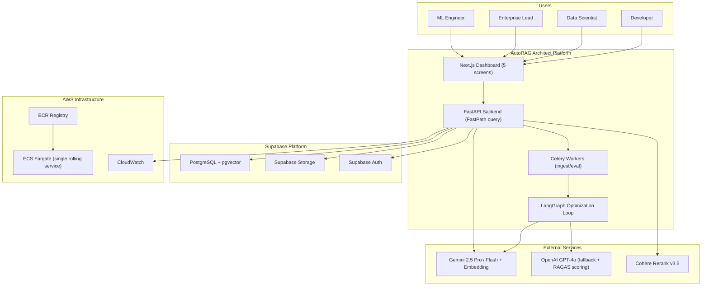
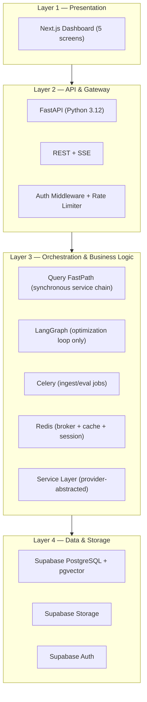
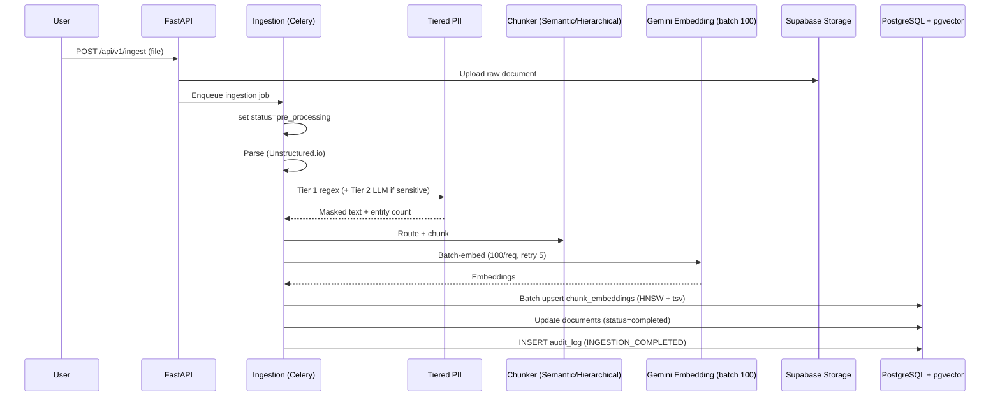
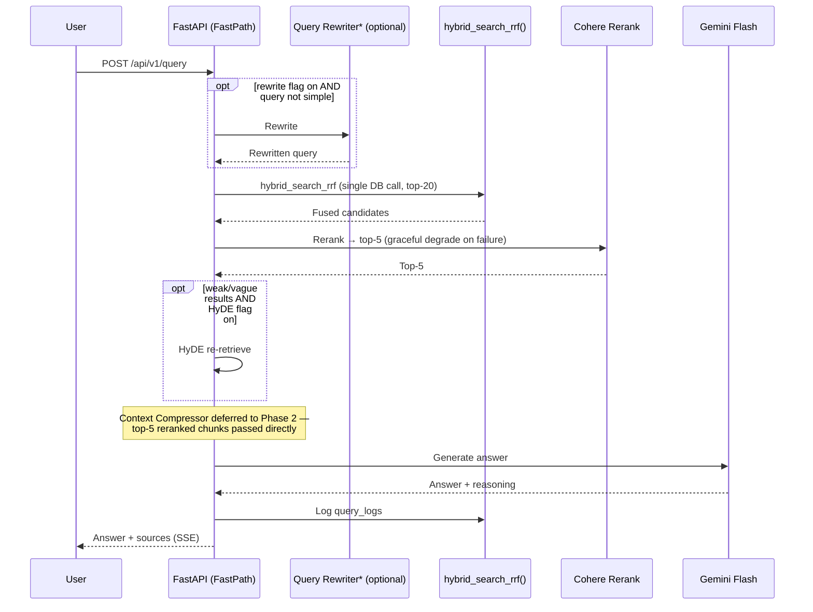
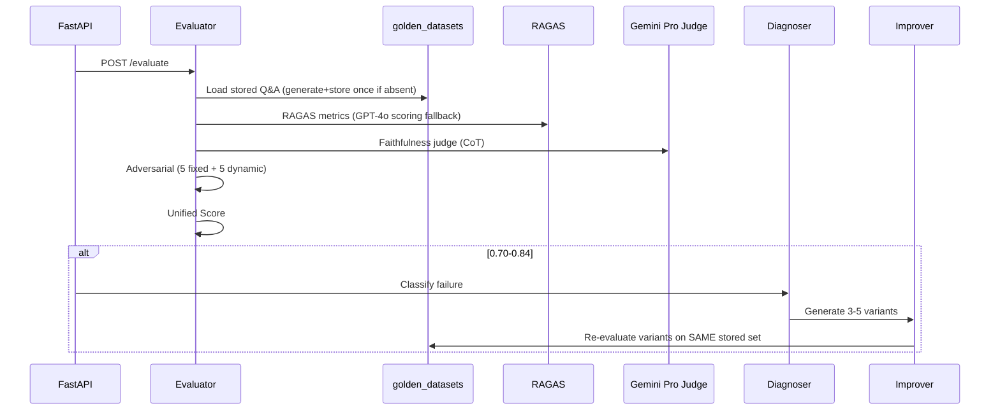
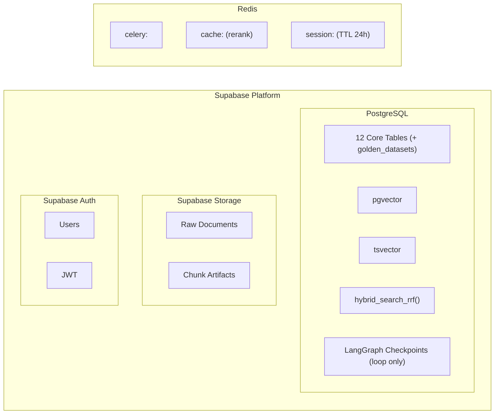
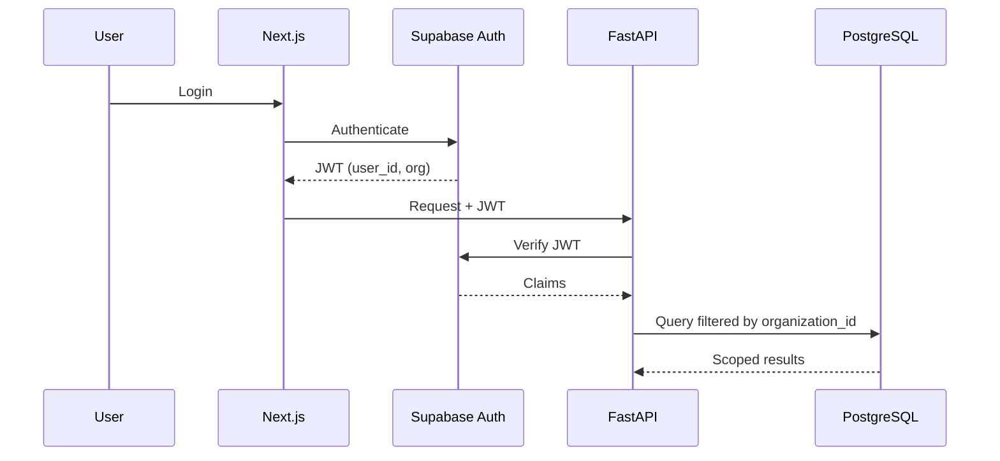
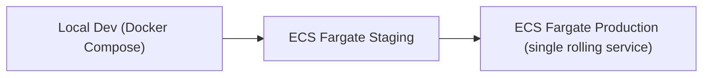

# AutoRAG Architect — High-Level Design (HLD)

**Version**: 2.0 (MVP-Hardened Revision) | **Classification**: Proprietary & Confidential
**Date**: May 2026 | **Status**: Approved
**Supersedes**: HLD v1.0

---

## Table of Contents

1. [Introduction](#1-introduction)
2. [System Context](#2-system-context)
3. [Architecture Layers](#3-architecture-layers)
4. [9-Agent Model — Three Execution Flows](#4-9-agent-model--three-execution-flows)
5. [Data Flow Diagrams](#5-data-flow-diagrams)
6. [Technology Stack](#6-technology-stack)
7. [Data Architecture](#7-data-architecture)
8. [Integration Architecture](#8-integration-architecture)
9. [Security Architecture](#9-security-architecture)
10. [Observability Architecture](#10-observability-architecture)
11. [Deployment Topology](#11-deployment-topology)
12. [Non-Functional Requirements](#12-non-functional-requirements)
13. [Source Documents](#13-source-documents)

---

## 1. Introduction

### 1.1 Purpose

This HLD defines the WHAT of AutoRAG Architect — system boundaries, layers, component responsibilities, data flows, and deployment topology. v2.0 hardens the design for a shippable, accurate MVP.

### 1.2 Key v2.0 Architectural Principles

1. **Separate the flows.** The 9 agents are conceptual; the system runs as **three flows**: Ingest (background), Query **FastPath** (synchronous), and Optimization (LangGraph). LangGraph is used **only** for the asynchronous optimization loop.
2. **Keep queries fast.** The query path is a synchronous function chain — no checkpoint overhead — with Query Rewriter and HyDE as **optional flags** (off by default). Context Compressor is deferred to Phase 2 (MVP passes the top-5 reranked chunks directly).
3. **Evaluate against a constant.** A stored static Q&A set makes variant comparisons reproducible and cheap.
4. **Deploy = activate config.** A pipeline promotion is a config-version activation + cache invalidation, with instant rollback. (Blue/Green ECS canary → Phase 2.)
5. **Abstract providers.** Embedding, vector store, reranker, and LLM live behind abstract base classes.

### 1.3 Document Relationships

| Document | Defines | Version |
|----------|---------|---------|
| BRD v2.0 | WHY — business problems, objectives, metrics | 2.0 |
| PRD v3.0 | WHAT (product) — features, flows, approval | 3.0 |
| HLD v2.0 (this) | WHAT (system) — layers, components, flows | 2.0 |
| LLD v2.0 | HOW — schemas, classes, algorithms, contracts | 2.0 |

---

## 2. System Context

### 2.1 System Context Diagram



### 2.2 System Boundaries

| Boundary | Inside | Outside |
|----------|--------|---------|
| Data | Documents processed/stored in Supabase | SharePoint/Confluence (Phase 2) |
| Auth | Supabase Auth | External SSO/SAML (Phase 2) |
| Compute | ECS Fargate | On-prem GPUs (out of scope) |
| AI Models | Gemini + OpenAI fallback | Fine-tuned custom models (out of scope) |
| Notifications | Dashboard alerts | Email/SMS/Slack (Phase 2) |

---

## 3. Architecture Layers

### 3.1 Four-Layer Architecture



### 3.2 Layer Responsibilities

| Layer | Responsibility | Key Components |
|-------|---------------|----------------|
| **Presentation** | Pipeline mgmt, score viz, query playground, approvals | Next.js, React, TS (5 screens) |
| **API & Gateway** | Routing, auth, rate limiting, **synchronous FastPath** | FastAPI, JWT validation, SSE |
| **Orchestration** | Query chain (sync), optimization loop (LangGraph), async jobs (Celery) | FastPath services, LangGraph graph, Celery, Redis |
| **Data & Storage** | Persistent storage, vector search, files, auth | Supabase PostgreSQL + pgvector + Storage + Auth |

### 3.3 Component Map

| Component | Layer | Purpose |
|-----------|-------|---------|
| Next.js Dashboard | Presentation | 5 screens — pipelines, score card, query playground, experiments, audit |
| FastAPI App | API | REST endpoints + SSE; hosts the synchronous query FastPath |
| Query FastPath | Orchestration | Synchronous chain: rewrite?* → hybrid retrieve → rerank → generate (Context Compressor deferred to P2) |
| LangGraph Loop | Orchestration | Evaluator → Observer → Diagnoser → Improver → Deployer (async, checkpointed) |
| Celery Workers | Orchestration | Ingestion, evaluation jobs |
| Redis | Orchestration | Broker + rerank cache + session (prefixed keys) |
| Service Layer | Orchestration | Provider-abstracted: LLM, embedding, reranker, vector store, PII, audit, approval, storage, cloudwatch |
| Supabase PostgreSQL | Data | 12 tables incl. golden_datasets |
| Supabase pgvector | Data | HNSW 768-dim + tsvector; DB-level RRF function |
| Supabase Storage | Data | Raw docs + artifacts |
| Supabase Auth | Data | JWT, sessions |

---

## 4. 9-Agent Model — Three Execution Flows

### 4.1 Agent Overview

The 9 agents are a **conceptual model**. For MVP they collapse into **~5 build components** (see §4.1.1) — Builder merges into Ingestion, Diagnoser runs rule-based inside the Evaluator, Context Compressor is deferred to Phase 2, and Query Rewriter / HyDE become optional flags.

| # | Agent | Flow | Purpose | Engine | MVP Build Status |
|---|-------|------|---------|--------|------------------|
| 1 | Ingestion | Ingest | Load, PII-mask, chunk, **embed + index** | Rule-based + gemini-embedding-001 | Build (absorbs Builder) |
| 2 | Builder | Ingest | Batch-embed, index, configure retrieval | gemini-embedding-001 | Merged into Ingestion |
| 3 | Query Rewriter | Query | rewrite ambiguous queries | Gemini Flash | Optional flag (off by default) |
| 4 | Context Compressor | Query | compress context | Gemini Flash | Deferred to Phase 2 |
| 5 | Evaluator | Optimize | Score vs stored set, compute Unified Score, **rule-based failure classification** | Gemini Pro + Flash | Build (absorbs MVP Diagnoser) |
| 6 | Observer | Optimize | monitor drift/latency/cost | Metric-based | Scheduled cron stub |
| 7 | Diagnoser | Optimize | Classify failures, recommend | Gemini Pro | Rule-based in Evaluator (MVP); LLM agent in P2 |
| 8 | Improver | Optimize | Generate variants, test on constant set | Gemini Flash + Pro | Build (core) |
| 9 | Deployer | Optimize | Activate config version + invalidate cache | DB + cache | Build (lightweight) |

#### 4.1.1 MVP Implementation Mapping (9 concepts → 5 components)

| MVP Component | Covers Agents | Notes |
|---|---|---|
| **1. Ingestion Pipeline** | Ingestion + Builder | One Celery job: parse → PII → chunk → embed → index |
| **2. Query FastPath** | Query Rewriter*, HyDE*, retrieval + rerank | Synchronous; rewrite/HyDE optional; Context Compressor deferred |
| **3. Evaluator** | Evaluator + Diagnoser (rule-based) | Core scoring brain |
| **4. Improver** | Improver | Core self-tuning brain |
| **5. Deployer** | Deployer | Config activation + instant rollback |
| *(stub)* **Observer** | Observer | Scheduled cron re-evaluating against the golden set |

### 4.2 The Three Flows

```mermaid
graph TD
    subgraph Ingest["Flow 1 — Ingest (single Celery pipeline; Builder folded in)"]
        ING["Ingestion (parse → PII → chunk → embed → index)"]
    end

    subgraph Query["Flow 2 — Query FastPath (synchronous, NOT LangGraph)"]
        QR["Query Rewriter* (optional)"] --> RET["Hybrid Retrieval (DB-level RRF)"]
        RET --> RR["Cohere Rerank (graceful degrade)"]
        RR --> HYDE{"Weak / vague?"}
        HYDE -->|yes| HY["HyDE re-retrieve* (optional)"] --> GEN
        HYDE -->|no| GEN["Generation"]
    end

    subgraph Optimize["Flow 3 — Optimization Loop (LangGraph)"]
        EVAL[Evaluator] -->|"≥0.85"| OBS[Observer]
        EVAL -->|"0.70-0.84"| DIAG[Diagnoser]
        EVAL -->|"<0.70"| BLOCK([HARD BLOCK])
        OBS -->|drift| DIAG
        OBS -->|stable| STABLE([Stable])
        DIAG --> IMP[Improver]
        IMP -->|approved| EVAL
        IMP -->|denied| STOP([Stopped])
        EVAL -->|deploy eligible| DEP[Deployer]
        DEP --> OBS
    end
```



> `*` optional flags, off by default, bypassed for simple queries. Context Compressor is deferred to Phase 2; for MVP the top-5 reranked chunks go straight to Generation. The Optimization Loop's Diagnoser node runs rule-based logic inside the Evaluator for MVP.

### 4.3 LangGraph Usage Boundary

| Flow | Runtime | Uses LangGraph? | Checkpointed? |
|------|---------|-----------------|---------------|
| Ingest | Celery background job | No (simple step chain) | No |
| **Query FastPath** | **Synchronous in FastAPI** | **No** | **No** |
| Optimization | Async LangGraph graph | **Yes** | Yes (PostgresSaver, PII stripped) |

Rationale: checkpoint serialization adds 50–200ms/node. The query path must be a lightweight synchronous chain to hit p95 < 3s.

---

## 5. Data Flow Diagrams

### 5.1 Document Ingestion Flow



### 5.2 Query FastPath (Synchronous)



### 5.3 Evaluation & Improvement Flow (Static Set)



---

## 6. Technology Stack

### 6.1 Complete Stack

| Layer | Technology | Purpose |
|-------|-----------|---------|
| Operational DB | Supabase PostgreSQL | Configs, runs, evals, audit, golden set, checkpoints |
| Vector DB | Supabase pgvector (HNSW) | 768-dim Gemini embeddings |
| Hybrid Search | pgvector + tsvector + **`hybrid_search_rrf` PL/pgSQL** | Single-call dense+keyword fusion |
| Object Storage | Supabase Storage | Raw docs + artifacts |
| Auth | Supabase Auth | JWT, sessions, org scoping |
| DB Access | `supabase-py` + `asyncpg` + Alembic | CRUD + perf-critical SQL + migrations (no ORM) |
| Embedding | `gemini-embedding-001` (768-dim) | Primary embeddings (batch 100) |
| LLM Primary | Gemini 2.5 Pro + Flash | Judge + fast ops |
| LLM Fallback | OpenAI GPT-4o | Failover + RAGAS scoring |
| Orchestration | LangGraph (loop) + Celery (jobs) | Async optimization + background tasks |
| Broker/Cache | Redis (prefixed keys) | Queue + rerank cache + session |
| Reranker | Cohere Rerank v3.5 (graceful degrade) | Precision |
| PII | Tiered (regex + optional Gemini Flash) | Boundary masking |
| Doc Parsing | Unstructured.io | Multi-format |
| Evaluation | RAGAS + Gemini Judge (GPT-4o fallback) | Metrics + Unified Score |
| Backend | FastAPI (Python 3.12) | REST + SSE |
| Frontend | Next.js 14/15 (TS) | 5-screen dashboard |
| Package Manager | uv | Dependency management |
| Deployment | ECS Fargate + ECR (single rolling service) | Containers |
| CI/CD | GitHub Actions | Build/test/deploy |
| Monitoring | CloudWatch | Logs/metrics/alarms |

### 6.2 Technology Decision Rationale

| Decision | Rationale |
|----------|-----------|
| Supabase unified platform | One platform for DB, vectors, storage, auth — minimal ops for a small team |
| `supabase-py` + `asyncpg` over SQLAlchemy ORM | Avoid ORM overhead; raw SQL for vector/bulk; Alembic standalone for migrations |
| LangGraph only for the optimization loop | Query path must be fast; checkpointing belongs to async work |
| DB-level RRF function | Single round trip; fusion in Postgres, not Python |
| 2 chunking strategies | Late Chunking needs token-level embeddings Gemini doesn't expose |
| Static stored Q&A set | Reproducible comparisons; ~zero recurring generation cost |
| Config-activation deploy | A pipeline change is config + data, not application code |
| Provider abstraction (ABCs) | Trivial provider swaps; graceful degradation |
| Cohere graceful degradation | Reranker outage degrades precision, not availability |

---

## 7. Data Architecture

### 7.1 Storage Map



### 7.2 Database Tables (12)

`pipelines`, `pipeline_runs` (+ `prompt_versions JSONB`), `evaluations`, `experiments`, `deployments`, `audit_log` (INSERT-ONLY), `query_logs`, `documents` (+ `status`), `chunk_embeddings`, `agent_retries`, `doc_relationships`, **`golden_datasets`** (stored static Q&A + expected chunks + human scores). Full DDL in LLD §3.

### 7.3 Vector Search Architecture

| Method | PostgreSQL Feature | Purpose |
|--------|-------------------|---------|
| Dense | pgvector HNSW (`vector_cosine_ops`, m=16, ef_construct=200) | Semantic search |
| Keyword | tsvector + ts_rank (GIN) | Full-text |
| **Hybrid** | **`hybrid_search_rrf()` PL/pgSQL (RRF, k=60)** | Single-call fusion |
| Reranking | Cohere Rerank v3.5 (graceful degrade) | top-20 → top-5 |
| HyDE | Gemini Flash hypothetical doc | **Conditional** (weak/vague queries only) |

---

## 8. Integration Architecture

### 8.1 External Service Map

| Service | Protocol | Purpose | Failover |
|---------|----------|---------|----------|
| Gemini 2.5 Pro | HTTPS | Judging, diagnosis, faithfulness | → GPT-4o |
| Gemini 2.5 Flash | HTTPS | Rewrite, compress, variants, HyDE, Q&A gen | → GPT-4o |
| gemini-embedding-001 | HTTPS | 768-dim embeddings (batch 100) | None (critical) |
| OpenAI GPT-4o | HTTPS | LLM fallback + RAGAS scoring fallback | → Ollama (P2) |
| Cohere Rerank v3.5 | HTTPS | Reranking | Graceful degradation |
| Supabase | HTTPS + WS | DB, pgvector, Storage, Auth | None (critical) |
| AWS ECS / CloudWatch | AWS SDK | Deploy, logs, metrics | AWS redundancy |

### 8.2 LLM Provider Assignment

| Task | Primary | Fallback |
|------|---------|----------|
| Faithfulness / diagnosis judging | Gemini 2.5 Pro | GPT-4o |
| RAGAS metric scoring | Gemini 2.5 Pro | **GPT-4o (if correlation < 0.70)** |
| Q&A gen, rewrite, compress, variants, HyDE | Gemini 2.5 Flash | GPT-4o |
| Adversarial judging | Gemini 2.5 Pro | GPT-4o |

---

## 9. Security Architecture

### 9.1 Authentication & Authorization



### 9.2 Security Layers

| Layer | Control | Implementation |
|-------|---------|---------------|
| Authentication | Supabase Auth | Login, JWT, sessions |
| API Authorization | JWT middleware | Every endpoint validates JWT |
| Data Isolation | Org scoping | `organization_id` filter (RLS in Phase 2) |
| PII Protection | Tiered PII | Regex Tier 1 + optional Gemini Flash Tier 2 at boundary |
| Audit Trail | INSERT-ONLY | RULEs block UPDATE/DELETE |
| Secrets | AWS Secrets Manager | Injected at container |
| Transport | TLS 1.3 | HTTPS everywhere |

### 9.3 Tiered PII Flow

```
Upload → Tier 1 regex (email, phone, SSN/Aadhaar, credit card, IP)
       → if sensitive doc: Tier 2 Gemini Flash structured check on sampled chunks
       → flag in audit_log, mask entities, continue with masked text
```

---

## 10. Observability Architecture

### 10.1 Monitoring Stack (Phase 1)

| Capability | Tool | Configuration |
|-----------|------|---------------|
| Logs | CloudWatch Logs | JSON structured, 30-day retention |
| Metrics | CloudWatch Metrics | Unified Score, latency, cost |
| Alarms | CloudWatch Alarms | Error > 1%, p95 > 3s, score drift > 0.05, CPU > 80% |
| AI metrics | Observer (scheduled job) → PostgreSQL | Score trends, success rate, cost |

### 10.2 Observer (MVP = Scheduled Job)

The Observer runs as a **cron job every 6h**, evaluating a sample of recent queries from `query_logs` against the stored set. Real-time drift detection is Phase 2 (needs production traffic to be meaningful).

### 10.3 Key Alarms

| Alarm | Trigger | Action |
|-------|---------|--------|
| API Error Rate | 5xx/total > 1% over 5 min | SNS notification |
| p95 Latency | p95 > 3000ms | Flag for Observer |
| Score Drift | Unified Score drop > 0.05 | Trigger Diagnoser on next Observer run |
| Worker Queue Depth | Celery queue > 100 | Scale workers |
| ECS CPU High | CPU > 80% for 10 min | Scale out |

---

## 11. Deployment Topology

### 11.1 Environment Progression



### 11.2 ECS Service Architecture

| ECS Service | Purpose | Resources |
|-------------|---------|-----------|
| autorag-api | FastAPI + FastPath + SSE | 1 vCPU, 2 GB |
| autorag-worker | Celery (ingest/eval) + optimization loop | 2 vCPU, 4 GB |
| autorag-dashboard | Next.js | 0.5 vCPU, 1 GB |

### 11.3 MVP "Pipeline Deployment" (Config Activation)

```
1. Validate deploy_eligible = True (Unified Score ≥ 0.85, Faithfulness ≥ 0.50, adversarial anchors clean)
2. INSERT deployments row (status=active), set pipelines.active_version
3. Invalidate Redis cache for the pipeline
4. Write PIPELINE_DEPLOYED to audit_log
Rollback: point active_version back to previous row + invalidate cache + write PIPELINE_ROLLED_BACK (instant, reversible)
```

> **Application code** is shipped via a standard rolling ECS update. **Blue/Green ECS with ALB traffic shifting + 10-min canary is Phase 2.**

### 11.4 CI/CD Pipeline

| Stage | Tool | Pass Criteria |
|-------|------|---------------|
| 1 — Lint | ruff + mypy | Zero errors |
| 2 — Unit Tests | pytest | ≥ 80% coverage |
| 3 — Integration | pytest + Docker Compose | All pass |
| 4 — Build + Push | Docker + ECR | SHA-tagged |
| 5 — Staging Deploy | AWS CLI | Tasks running, /health healthy |
| 6 — Smoke Test | pytest remote | Score ≥ 0.70, /query returns answer |
| 7 — Manual Gate | GitHub Environments | Human approval |
| 8 — Production Deploy | AWS CLI | Rolling update, p95 < 3s |

---

## 12. Non-Functional Requirements

### 12.1 Performance SLOs

| Metric | Target |
|--------|--------|
| /query p50 | < 1s |
| /query p95 (FastPath) | < 3s |
| /query p99 | < 5s |
| Build (1,000 docs) | < 5 min |
| Evaluation (stored set) | < 8 min |
| Dashboard FCP | < 2s |

### 12.2 Reliability

| Metric | Target |
|--------|--------|
| API uptime | 99.5% |
| Config rollback time | < 10 seconds |
| LLM failover time | < 5 seconds |
| Data durability | 99.99% (Supabase) |

### 12.3 Cost Targets (Per Run)

| Item | Target |
|------|--------|
| Eval against stored set (50 Q&A) | < $0.60 (first run); ~$0 generation thereafter |
| Adversarial (10 Q) | < $0.10 |
| Cohere reranking per query | < $0.01 |
| Build (1,000 docs) | < $2 |
| Production /query | < $0.006 |

---

## 13. Source Documents

| Document | Path | Version |
|----------|------|---------|
| BRD | `AutoRAG_BRD_v1_0.md` | v2.0 |
| PRD | `AutoRAG_PRD_v2_4.md` | v3.0 |
| LLD | `AutoRAG-LLD-v1.0.md` | v2.0 |
| HLD | `AutoRAG-HLD-v1.0.md` (this) | v2.0 |

---
*AutoRAG Platform — Approved High-Level Design (v2.0, MVP-Hardened). Proprietary and Confidential.*
