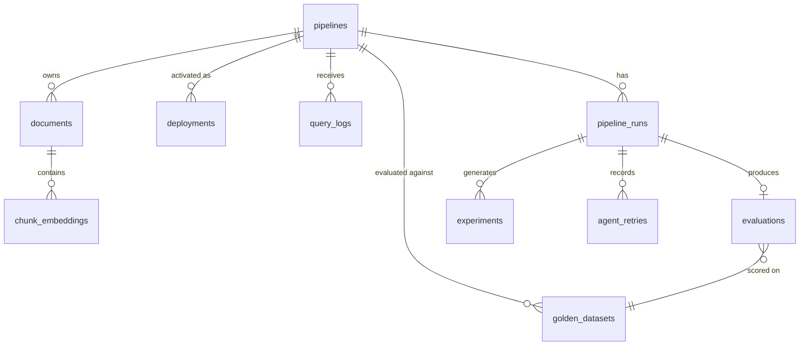

# AutoRAG Platform — Low-Level Design (LLD)

**Version**: 2.0 (MVP-Hardened Revision) | **Classification**: Proprietary & Confidential
**Date**: May 2026 | **Status**: Approved
**Supersedes**: LLD v1.0

---

## Table of Contents

1. [Introduction](#1-introduction)
2. [System Component Map](#2-system-component-map)
3. [Database Schema](#3-database-schema)
4. [Supabase pgvector Schema & DB-Level RRF](#4-supabase-pgvector-schema--db-level-rrf)
5. [Data Access Layer (supabase-py + asyncpg)](#5-data-access-layer)
6. [API Contract Definitions](#6-api-contract-definitions)
7. [Optimization-Loop State Object (LangGraph)](#7-optimization-loop-state-object)
8. [Agent / Flow Class Design](#8-agent--flow-class-design)
9. [Service Layer Design (Provider Abstraction)](#9-service-layer-design)
10. [Unified Score Algorithm](#10-unified-score-algorithm)
11. [Chunking Strategy Logic (2 Strategies)](#11-chunking-strategy-logic)
12. [Retrieval Pipeline (Hybrid → Rerank → Conditional HyDE)](#12-retrieval-pipeline)
13. [LLM Failover Chain](#13-llm-failover-chain)
14. [3-Tier Approval Model](#14-3-tier-approval-model)
15. [MVP Deployment (Config Activation)](#15-mvp-deployment)
16. [Observability Implementation](#16-observability-implementation)
17. [Error Codes and Domain Exceptions](#17-error-codes-and-domain-exceptions)
18. [Folder and Module Structure](#18-folder-and-module-structure)

---

## 1. Introduction

### 1.1 Purpose

This LLD defines implementation-level specifications for **AutoRAG Architect v2.0** — class designs, schemas, API contracts, algorithms, and module structure. It implements the v2.0 architectural decisions: three flows, synchronous query FastPath, static stored eval set, DB-level RRF, tiered PII, provider abstraction, and config-activation deployment.

### 1.2 Key v2.0 Implementation Changes

| Area | v1.0 | v2.0 |
|------|------|------|
| DB access | SQLAlchemy ORM | `supabase-py` (CRUD) + `asyncpg` (vector/bulk) + Alembic (migrations) |
| Query path | LangGraph state machine | Synchronous `QueryService` chain |
| Hybrid fusion | RRF in Python | `hybrid_search_rrf()` PL/pgSQL, single call |
| Chunking | 3 strategies | 2 (Semantic, Hierarchical); Late → Phase 2 |
| Eval set | Generated per run | Generated once, stored in `golden_datasets`, reused |
| HyDE | Always-on | Optional flag (off by default) |
| Query Rewriter | Always-on | Optional flag (off by default) |
| Builder | Separate agent | **Merged into Ingestion pipeline** (single Celery job) |
| Diagnoser | LLM agent | **Rule-based, inside Evaluator** for MVP; LLM agent → Phase 2 |
| Context Compressor | In query path | **Deferred to Phase 2** (top-5 reranked chunks passed directly) |
| Deployment | Blue/Green ECS canary | Config activation + instant rollback (Blue/Green → Phase 2) |
| Providers | Concrete services | Abstract base classes + concrete impls |
| Observer | Real-time | Scheduled job (cron stub) |

### 1.3 Scope

- Backend: FastAPI + Celery + LangGraph (loop only), Python 3.12
- Frontend: Next.js 14/15 (5 screens) — UI contracts only
- Data: Supabase PostgreSQL + pgvector + Storage + Auth, Redis 7
- Deployment: ECS Fargate (single rolling service)
- Package Manager: uv

---

## 2. System Component Map

| HLD Component | LLD Section |
| --- | --- |
| Supabase PostgreSQL (12 tables incl. golden_datasets) | §3 |
| pgvector + `hybrid_search_rrf` | §4 |
| Data access (supabase-py + asyncpg) | §5 |
| REST API endpoints | §6 |
| LangGraph GraphState + PostgresSaver (loop only) | §7 |
| Agent / flow classes | §8 |
| Provider-abstracted services | §9 |
| Unified Score + RAGAS + Adversarial | §10 |
| Chunking router (Semantic / Hierarchical) | §11 |
| Retrieval (Hybrid → Rerank → conditional HyDE) | §12 |
| LLM failover chain | §13 |
| 3-tier approval model | §14 |
| Config-activation deployment | §15 |
| Observability | §16 |
| Error codes / exceptions | §17 |
| Module structure | §18 |

---

## 3. Database Schema

### 3.1 Standards

- **Primary Keys**: UUID v7 (time-sortable)
- **Timestamps**: `TIMESTAMP WITH TIME ZONE` (UTC)
- **Migrations**: Alembic (standalone, no ORM models) — every change has `upgrade()` + `downgrade()`
- **Tenancy**: `organization_id` indexed on every table (RLS in Phase 2)
- **Naming**: `snake_case`

### 3.2 Table: `pipelines`

```sql
CREATE TABLE pipelines (
    id                UUID PRIMARY KEY DEFAULT uuid_generate_v7(),
    organization_id   UUID NOT NULL,
    name              VARCHAR(255) NOT NULL,
    description       TEXT,
    config            JSONB NOT NULL,
    chunking_strategy VARCHAR(50) NOT NULL
                      CHECK (chunking_strategy IN ('semantic','hierarchical','auto')),
    retrieval_method  VARCHAR(50) NOT NULL DEFAULT 'hybrid'
                      CHECK (retrieval_method IN ('dense','hybrid','hybrid_hyde')),
    llm_judge         VARCHAR(50) NOT NULL DEFAULT 'gemini-2.5-pro',
    approval_mode     VARCHAR(50) NOT NULL DEFAULT 'human_in_loop'
                      CHECK (approval_mode IN ('auto','human_in_loop','mandatory_gate')),
    active_version    UUID,                     -- current active deployments.id (config activation)
    status            VARCHAR(30) NOT NULL DEFAULT 'draft'
                      CHECK (status IN ('draft','active','archived')),
    created_by        UUID NOT NULL,
    created_at        TIMESTAMP WITH TIME ZONE DEFAULT NOW(),
    updated_at        TIMESTAMP WITH TIME ZONE DEFAULT NOW()
);
CREATE INDEX idx_pipelines_org ON pipelines(organization_id);
CREATE INDEX idx_pipelines_status ON pipelines(status);
```

### 3.3 Table: `pipeline_runs`

```sql
CREATE TABLE pipeline_runs (
    id              UUID PRIMARY KEY DEFAULT uuid_generate_v7(),
    pipeline_id     UUID NOT NULL REFERENCES pipelines(id),
    organization_id UUID NOT NULL,
    trace_id        UUID NOT NULL,
    status          VARCHAR(30) NOT NULL DEFAULT 'pending'
                    CHECK (status IN ('pending','running','completed','failed','cancelled')),
    triggered_by    VARCHAR(50) NOT NULL
                    CHECK (triggered_by IN ('api','observer','scheduler')),
    prompt_versions JSONB,                      -- {"faithfulness_judge":"v1.0.0","query_rewrite":"v1.0.0"}
    started_at      TIMESTAMP WITH TIME ZONE,
    completed_at    TIMESTAMP WITH TIME ZONE,
    error_message   TEXT,
    metadata        JSONB,
    created_at      TIMESTAMP WITH TIME ZONE DEFAULT NOW()
);
CREATE INDEX idx_runs_pipeline ON pipeline_runs(pipeline_id);
CREATE INDEX idx_runs_org ON pipeline_runs(organization_id);
CREATE INDEX idx_runs_status ON pipeline_runs(status);
```

### 3.4 Table: `evaluations`

```sql
CREATE TABLE evaluations (
    id                  UUID PRIMARY KEY DEFAULT uuid_generate_v7(),
    run_id              UUID NOT NULL REFERENCES pipeline_runs(id),
    organization_id     UUID NOT NULL,
    golden_set_id       UUID NOT NULL,          -- which stored set was used (reproducibility)
    unified_score       NUMERIC(5,4) NOT NULL,
    retrieval_score     NUMERIC(5,4) NOT NULL,
    quality_score       NUMERIC(5,4) NOT NULL,
    faithfulness_score  NUMERIC(5,4) NOT NULL,
    latency_penalty     NUMERIC(5,4) NOT NULL DEFAULT 0,
    cost_penalty        NUMERIC(5,4) NOT NULL DEFAULT 0,
    ragas_context_precision   NUMERIC(5,4),
    ragas_context_recall      NUMERIC(5,4),
    ragas_answer_faithfulness NUMERIC(5,4),
    ragas_answer_relevancy    NUMERIC(5,4),
    ragas_scorer        VARCHAR(50),            -- 'gemini-2.5-pro' | 'gpt-4o' (compatibility fallback)
    adversarial_pass_rate     NUMERIC(5,4),     -- fixed anchors must be 1.0
    adversarial_fail_count    INTEGER DEFAULT 0,
    adversarial_dynamic_count INTEGER DEFAULT 5,
    deploy_eligible     BOOLEAN NOT NULL DEFAULT FALSE,
    failure_reason      TEXT,
    judge_reasoning     TEXT,
    eval_duration_ms    INTEGER,
    created_at          TIMESTAMP WITH TIME ZONE DEFAULT NOW()
);
CREATE INDEX idx_eval_run ON evaluations(run_id);
CREATE INDEX idx_eval_org ON evaluations(organization_id);
CREATE INDEX idx_eval_score ON evaluations(unified_score);
```

### 3.5 Table: `golden_datasets` (NEW)

```sql
CREATE TABLE golden_datasets (
    id              UUID PRIMARY KEY DEFAULT uuid_generate_v7(),
    pipeline_id     UUID NOT NULL REFERENCES pipelines(id),
    organization_id UUID NOT NULL,
    question        TEXT NOT NULL,
    expected_answer TEXT,
    expected_chunks UUID[],                     -- references to chunk_embeddings (relevance labels for Recall@5)
    question_type   VARCHAR(30) NOT NULL DEFAULT 'synthetic'
                    CHECK (question_type IN ('synthetic','adversarial_fixed','adversarial_dynamic','human')),
    human_score     NUMERIC(5,4),               -- human-rated quality (calibration)
    set_version     INTEGER NOT NULL DEFAULT 1, -- frozen set; all variants evaluate against same version
    created_at      TIMESTAMP WITH TIME ZONE DEFAULT NOW()
);
CREATE INDEX idx_golden_pipeline ON golden_datasets(pipeline_id);
CREATE INDEX idx_golden_org ON golden_datasets(organization_id);
CREATE INDEX idx_golden_type ON golden_datasets(question_type);
```

> The synthetic Q&A set is generated **once** (at first evaluation) and frozen at `set_version`. Every variant tested by the Improver is scored against the **same** `golden_set_id`/`set_version`, guaranteeing reproducible comparisons and ~zero recurring generation cost. `expected_chunks` provides ground-truth labels for Recall@5 (generate each Q from a known chunk).

### 3.6 Table: `experiments`

```sql
CREATE TABLE experiments (
    id              UUID PRIMARY KEY DEFAULT uuid_generate_v7(),
    run_id          UUID NOT NULL REFERENCES pipeline_runs(id),
    organization_id UUID NOT NULL,
    parent_run_id   UUID REFERENCES pipeline_runs(id),
    golden_set_id   UUID NOT NULL,              -- same set as baseline (enforced)
    variant_config  JSONB NOT NULL,
    score_delta     NUMERIC(6,4),
    improvement_type VARCHAR(50),
    approval_tier   VARCHAR(30)
                    CHECK (approval_tier IN ('auto','human_in_loop','mandatory_gate')),
    approval_status VARCHAR(30) DEFAULT 'pending'
                    CHECK (approval_status IN ('pending','approved','rejected')),
    approved_by     UUID,
    created_at      TIMESTAMP WITH TIME ZONE DEFAULT NOW()
);
CREATE INDEX idx_experiments_run ON experiments(run_id);
CREATE INDEX idx_experiments_org ON experiments(organization_id);
```

### 3.7 Table: `deployments` (Config Activation)

```sql
CREATE TABLE deployments (
    id                  UUID PRIMARY KEY DEFAULT uuid_generate_v7(),
    pipeline_id         UUID NOT NULL REFERENCES pipelines(id),
    run_id              UUID NOT NULL REFERENCES pipeline_runs(id),
    organization_id     UUID NOT NULL,
    config_snapshot     JSONB NOT NULL,         -- the activated pipeline config version
    previous_deployment UUID REFERENCES deployments(id),  -- for instant rollback
    environment         VARCHAR(20) NOT NULL DEFAULT 'production'
                        CHECK (environment IN ('staging','production')),
    strategy            VARCHAR(20) NOT NULL DEFAULT 'config_activation',
    status              VARCHAR(30) NOT NULL DEFAULT 'active'
                        CHECK (status IN ('active','rolled_back','superseded')),
    unified_score       NUMERIC(5,4) NOT NULL,
    activated_at        TIMESTAMP WITH TIME ZONE DEFAULT NOW(),
    rolled_back_at      TIMESTAMP WITH TIME ZONE,
    rollback_reason     TEXT,
    created_at          TIMESTAMP WITH TIME ZONE DEFAULT NOW()
);
CREATE INDEX idx_deploy_pipeline ON deployments(pipeline_id);
CREATE INDEX idx_deploy_org ON deployments(organization_id);
CREATE INDEX idx_deploy_status ON deployments(status);
```

> **Phase 2** adds ECS/ALB fields (`ecs_task_arn`, `alb_target_group`, `canary_*`) for Blue/Green.

### 3.8 Table: `audit_log` (INSERT-ONLY)

```sql
CREATE TABLE audit_log (
    id              UUID PRIMARY KEY DEFAULT uuid_generate_v7(),
    organization_id UUID NOT NULL,
    event_type      VARCHAR(50) NOT NULL CHECK (event_type IN (
                        'PIPELINE_CREATED','PIPELINE_UPDATED',
                        'INGESTION_STARTED','INGESTION_COMPLETED',
                        'DOCUMENT_STATUS_CHANGED',
                        'EVALUATION_STARTED','EVALUATION_COMPLETED',
                        'IMPROVEMENT_TRIGGERED',
                        'APPROVAL_GRANTED','APPROVAL_DENIED',
                        'PIPELINE_DEPLOYED','PIPELINE_ROLLED_BACK'
                    )),
    actor_id        UUID NOT NULL,
    resource_type   VARCHAR(50) NOT NULL,
    resource_id     UUID NOT NULL,
    trace_id        UUID NOT NULL,
    payload         JSONB,                      -- no PII
    ip_address      INET,
    created_at      TIMESTAMP WITH TIME ZONE DEFAULT NOW()
);
CREATE INDEX idx_audit_org ON audit_log(organization_id);
CREATE INDEX idx_audit_event ON audit_log(event_type);
CREATE INDEX idx_audit_resource ON audit_log(resource_id);
CREATE INDEX idx_audit_trace ON audit_log(trace_id);

CREATE RULE audit_log_no_update AS ON UPDATE TO audit_log DO INSTEAD NOTHING;
CREATE RULE audit_log_no_delete AS ON DELETE TO audit_log DO INSTEAD NOTHING;
```

### 3.9 Table: `query_logs`

```sql
CREATE TABLE query_logs (
    id              UUID PRIMARY KEY DEFAULT uuid_generate_v7(),
    pipeline_id     UUID NOT NULL REFERENCES pipelines(id),
    organization_id UUID NOT NULL,
    trace_id        UUID NOT NULL,
    query_hash      VARCHAR(64) NOT NULL,       -- SHA256 of masked query
    rewrite_applied BOOLEAN NOT NULL DEFAULT FALSE,
    hyde_applied    BOOLEAN NOT NULL DEFAULT FALSE,
    compression_applied BOOLEAN NOT NULL DEFAULT FALSE,
    retrieval_k     INTEGER NOT NULL,
    chunks_retrieved INTEGER NOT NULL,
    rerank_applied  BOOLEAN NOT NULL DEFAULT FALSE,
    latency_ms      INTEGER NOT NULL,
    token_count     INTEGER,
    llm_provider    VARCHAR(50),
    created_at      TIMESTAMP WITH TIME ZONE DEFAULT NOW()
);
CREATE INDEX idx_qlogs_pipeline ON query_logs(pipeline_id);
CREATE INDEX idx_qlogs_org ON query_logs(organization_id);
CREATE INDEX idx_qlogs_latency ON query_logs(latency_ms);
```

### 3.10 Table: `documents` (with status state machine)

```sql
CREATE TABLE documents (
    id              UUID PRIMARY KEY DEFAULT uuid_generate_v7(),
    organization_id UUID NOT NULL,
    pipeline_id     UUID NOT NULL REFERENCES pipelines(id),
    filename        VARCHAR(255) NOT NULL,
    file_size       BIGINT NOT NULL,
    storage_path    VARCHAR(512) NOT NULL,
    status          VARCHAR(30) NOT NULL DEFAULT 'queued'
                    CHECK (status IN ('queued','pre_processing','processing','completed','failed','cancelled')),
    chunk_count     INTEGER NOT NULL DEFAULT 0,
    pii_entities    INTEGER NOT NULL DEFAULT 0,
    pii_tier2_run   BOOLEAN NOT NULL DEFAULT FALSE,
    error           TEXT,
    created_at      TIMESTAMP WITH TIME ZONE DEFAULT NOW(),
    updated_at      TIMESTAMP WITH TIME ZONE DEFAULT NOW()
);
CREATE INDEX idx_documents_pipeline ON documents(pipeline_id);
CREATE INDEX idx_documents_org ON documents(organization_id);
CREATE INDEX idx_documents_status ON documents(status);
```

### 3.11 Table: `chunk_embeddings`

```sql
CREATE TABLE chunk_embeddings (
    id              UUID PRIMARY KEY DEFAULT uuid_generate_v7(),
    document_id     UUID NOT NULL REFERENCES documents(id) ON DELETE CASCADE,
    pipeline_id     UUID NOT NULL REFERENCES pipelines(id) ON DELETE CASCADE,
    organization_id UUID NOT NULL,
    chunk_index     INTEGER NOT NULL,
    token_count     INTEGER NOT NULL,
    content         TEXT NOT NULL,
    embedding       vector(768) NOT NULL,       -- gemini-embedding-001 (768-dim via MRL)
    tsv             tsvector,
    page_number     INTEGER,
    chunk_strategy  VARCHAR(50) NOT NULL
                    CHECK (chunk_strategy IN ('semantic','hierarchical_parent','hierarchical_child')),
    created_at      TIMESTAMP WITH TIME ZONE DEFAULT NOW()
);
CREATE INDEX idx_chunks_doc ON chunk_embeddings (document_id);
CREATE INDEX idx_chunks_pipeline ON chunk_embeddings (pipeline_id);
-- vector + tsv indexes in §4
```

### 3.12 Tables: `agent_retries`, `doc_relationships`

```sql
CREATE TABLE agent_retries (
    id              UUID PRIMARY KEY DEFAULT uuid_generate_v7(),
    run_id          UUID NOT NULL REFERENCES pipeline_runs(id),
    organization_id UUID NOT NULL,
    agent_name      VARCHAR(50) NOT NULL,
    attempt_number  INTEGER NOT NULL,
    error_type      VARCHAR(100) NOT NULL,
    error_message   TEXT,
    provider_used   VARCHAR(50),
    retry_at        TIMESTAMP WITH TIME ZONE DEFAULT NOW()
);
CREATE INDEX idx_retries_run ON agent_retries(run_id);

CREATE TABLE doc_relationships (
    id              UUID PRIMARY KEY DEFAULT uuid_generate_v7(),
    pipeline_id     UUID NOT NULL REFERENCES pipelines(id),
    organization_id UUID NOT NULL,
    parent_chunk_id UUID NOT NULL,
    child_chunk_id  UUID NOT NULL,
    source_doc_id   UUID NOT NULL,
    parent_tokens   INTEGER NOT NULL DEFAULT 1024,
    child_tokens    INTEGER NOT NULL DEFAULT 128,
    page_number     INTEGER,
    created_at      TIMESTAMP WITH TIME ZONE DEFAULT NOW()
);
CREATE INDEX idx_docrel_pipeline ON doc_relationships(pipeline_id);
CREATE INDEX idx_docrel_parent ON doc_relationships(parent_chunk_id);
```

### 3.13 ER Diagram



---

## 4. Supabase pgvector Schema & DB-Level RRF

### 4.1 Index Setup

```sql
CREATE EXTENSION IF NOT EXISTS vector;

CREATE INDEX idx_chunk_embeddings_cosine ON chunk_embeddings
USING hnsw (embedding vector_cosine_ops)
WITH (m = 16, ef_construction = 200);

CREATE INDEX idx_chunk_embeddings_tsv ON chunk_embeddings
USING gin (tsv);
```

### 4.2 DB-Level Reciprocal Rank Fusion

Hybrid fusion runs **inside PostgreSQL in a single call**, avoiding two round trips + Python fusion overhead.

```sql
CREATE OR REPLACE FUNCTION hybrid_search_rrf(
    query_text   TEXT,
    query_emb    vector(768),
    pipeline_uuid UUID,
    match_limit  INT DEFAULT 20,
    k            INT DEFAULT 60
)
RETURNS TABLE (chunk_id UUID, content TEXT, rrf_score NUMERIC)
LANGUAGE sql STABLE AS $$
  WITH dense AS (
    SELECT id,
           ROW_NUMBER() OVER (ORDER BY embedding <=> query_emb) AS rnk
    FROM chunk_embeddings
    WHERE pipeline_id = pipeline_uuid
    ORDER BY embedding <=> query_emb
    LIMIT match_limit * 2
  ),
  keyword AS (
    SELECT id,
           ROW_NUMBER() OVER (
             ORDER BY ts_rank(tsv, plainto_tsquery('english', query_text)) DESC
           ) AS rnk
    FROM chunk_embeddings
    WHERE pipeline_id = pipeline_uuid
      AND tsv @@ plainto_tsquery('english', query_text)
    ORDER BY ts_rank(tsv, plainto_tsquery('english', query_text)) DESC
    LIMIT match_limit * 2
  ),
  fused AS (
    SELECT COALESCE(d.id, kw.id) AS id,
           COALESCE(1.0 / (k + d.rnk), 0) + COALESCE(1.0 / (k + kw.rnk), 0) AS score
    FROM dense d
    FULL OUTER JOIN keyword kw ON d.id = kw.id
  )
  SELECT c.id, c.content, f.score::NUMERIC AS rrf_score
  FROM fused f
  JOIN chunk_embeddings c ON c.id = f.id
  ORDER BY f.score DESC
  LIMIT match_limit;
$$;
```

> The application calls this once per query; reranking (Cohere) is applied to its top-20 output in Python.

---

## 5. Data Access Layer

No ORM. Two access paths:

- **`supabase-py`** — simple CRUD, Auth, Storage, dashboard reads.
- **`asyncpg`** — performance-critical: vector search (`hybrid_search_rrf`), batch chunk upserts, bulk reads.
- **Alembic** (standalone, raw-SQL migrations) — schema versioning with `upgrade()`/`downgrade()`.

```python
# repositories/chunk_repo.py
class ChunkRepository:
    def __init__(self, pool: asyncpg.Pool): ...

    async def bulk_upsert(self, chunks: list[EmbeddedChunk]) -> int:
        """COPY/executemany batch insert into chunk_embeddings."""

    async def hybrid_search(
        self, query_text: str, query_emb: list[float], pipeline_id: UUID, limit: int = 20
    ) -> list[ScoredChunk]:
        rows = await self.pool.fetch(
            "SELECT * FROM hybrid_search_rrf($1, $2, $3, $4)",
            query_text, query_emb, pipeline_id, limit,
        )
        return [ScoredChunk(**dict(r)) for r in rows]
```

---

## 6. API Contract Definitions

### 6.1 Standard Response Wrapper

```json
{
  "status": "success | error",
  "data": {},
  "error": { "code": "ERR_CODE", "message": "...", "details": {} },
  "request_id": "uuid-v7"
}
```

### 6.2 Selected Endpoint Contracts

#### `POST /api/v1/pipelines` (direct config — no wizard)

```json
{ "name": "string", "description": "string", "config": {}, "pipeline_id": "uuid | null" }
```

#### `POST /api/v1/ingest` (multipart)

```
file: <binary>
pipeline_id: uuid
```
Response `data`: `{ "job_id": "uuid", "document_id": "uuid", "status": "queued", "pii_entities_masked": 0 }`

#### `POST /api/v1/query` (FastPath, SSE)

Request:
```json
{ "pipeline_id": "uuid", "q": "string", "top_k": 5, "mode": "fast | agentic",
  "options": { "rewrite": "off", "hyde": "off" } }
```
> `rewrite` and `hyde` are optional flags, **default `off`** to protect p95 < 3s. Context Compressor is deferred to Phase 2, so there is no `compress` option in the MVP contract.

Response `data`:
```json
{
  "answer": "string",
  "sources": [{ "chunk_id": "uuid", "page_number": 3, "score": 0.91 }],
  "latency_ms": 420,
  "llm_provider": "gemini-2.5-flash",
  "stages": { "rewrite_applied": false, "hyde_applied": false }
}
```

#### `POST /api/v1/pipelines/{id}/evaluate`

```json
{ "run_type": "full | quick", "force": false }
```
Response `data`: `{ "job_id": "uuid", "run_id": "uuid", "golden_set_id": "uuid", "status": "queued" }`

#### `GET /api/v1/score/{run_id}`

```json
{
  "run_id": "uuid", "golden_set_id": "uuid",
  "unified_score": 0.87, "retrieval_score": 0.9, "quality_score": 0.88,
  "faithfulness_score": 0.85, "latency_penalty": 0.0, "cost_penalty": 0.0,
  "ragas": { "context_precision": 0.82, "context_recall": 0.86,
             "answer_faithfulness": 0.85, "answer_relevancy": 0.88 },
  "ragas_scorer": "gemini-2.5-pro",
  "adversarial_pass_rate": 1.0, "deploy_eligible": true, "failure_taxonomy": null
}
```

#### `POST /api/v1/deploy/{run_id}` (config activation)

Response `data`: `{ "deployment_id": "uuid", "strategy": "config_activation", "status": "active" }`

#### `POST /api/v1/deploy/rollback`

```json
{ "deployment_id": "uuid", "reason": "string" }
```
Response `data`: `{ "rollback_id": "uuid", "reverted_to_deployment": "uuid", "status": "active" }`

Other endpoints (`/diagnose`, `/improve`, `/approve`, `/experiments`, `/experiments/compare`, `/observe`, `/jobs/{id}`, `/audit-log`) follow the same wrapper.

---

## 7. Optimization-Loop State Object (LangGraph)

> LangGraph state is used **only** for the asynchronous optimization loop. The query FastPath does NOT use this.

```python
from pydantic import BaseModel, Field
from uuid import UUID
from enum import Enum

class FailureType(str, Enum):
    RETRIEVAL_MISS = "retrieval_miss"
    CONTEXT_OVERFLOW = "context_overflow"
    HALLUCINATION = "hallucination"
    ANSWER_INCOMPLETENESS = "answer_incompleteness"
    LATENCY_SPIKE = "latency_spike"

class ApprovalTier(str, Enum):
    AUTO = "auto"
    HUMAN_IN_LOOP = "human_in_loop"
    MANDATORY_GATE = "mandatory_gate"

class OptimizationState(BaseModel):
    # Identity
    run_id: UUID
    pipeline_id: UUID
    organization_id: UUID
    trace_id: UUID
    golden_set_id: UUID                 # constant eval set for this loop

    pipeline_config: dict
    # Evaluation
    unified_score: float | None = None
    retrieval_score: float | None = None
    quality_score: float | None = None
    faithfulness_score: float | None = None
    latency_penalty: float = 0.0
    cost_penalty: float = 0.0
    ragas_scores: dict[str, float] = Field(default_factory=dict)
    ragas_scorer: str = "gemini-2.5-pro"
    adversarial_pass_rate: float | None = None
    deploy_eligible: bool = False
    judge_reasoning: str | None = None
    # Observer / Diagnoser (Diagnoser is rule-based inside Evaluator for MVP)
    score_drift_detected: bool = False
    diagnosis: list[str] = Field(default_factory=list)   # rule-based remediation hints (MVP)
    failure_type: FailureType | None = None              # populated by LLM Diagnoser in Phase 2
    failure_confidence: float | None = None
    remediation_suggestion: str | None = None
    # Improver
    variant_configs: list[dict] = Field(default_factory=list)
    approval_tier: ApprovalTier | None = None
    approved_variant: dict | None = None
    # Deployer
    deployment_id: UUID | None = None
    # Control
    current_agent: str = "evaluator"
    retry_count: int = 0
    error_message: str | None = None
```

### 7.2 PostgresSaver Configuration

```python
from langgraph.checkpoint.postgres import PostgresSaver
checkpointer = PostgresSaver.from_conn_string(settings.POSTGRES_URL)
# The optimization loop carries NO raw query/chunk text, so no PII reaches checkpoints.
```

### 7.3 Conditional Edge Logic (loop only)

For MVP there is **no separate diagnoser node** — the Evaluator attaches rule-based `diagnosis` hints (§8.3) before routing straight to the Improver.

```
evaluator → observer    (if deploy_eligible)
evaluator → improver    (if 0.70 <= unified_score < 0.85 AND faithfulness >= 0.50; carries rule-based diagnosis)
evaluator → END         (if unified_score < 0.70 OR faithfulness < 0.50 — hard block)
observer  → improver    (if score_drift_detected; carries rule-based diagnosis)
observer  → END         (if stable)
improver  → evaluator   (after variant approved — re-eval on SAME golden_set_id)
improver  → END         (if approval denied)
evaluator → deployer    (if deploy_eligible after improvement)
deployer  → observer    (register new active version)
```

> Phase 2 re-inserts a dedicated LLM `diagnoser` node between Evaluator/Observer and Improver.

---

## 8. Agent / Flow Class Design

### 8.1 Query FastPath (Synchronous — NOT LangGraph)

```python
# app/services/query_service.py
class QueryService:
    def __init__(
        self,
        llm: BaseLLMProvider,
        embedder: BaseEmbeddingProvider,
        reranker: BaseReranker,
        chunk_repo: ChunkRepository,
    ): ...

    async def query(self, req: QueryRequest) -> QueryResult:
        """Synchronous chain: rewrite?* -> hybrid -> rerank -> hyde?* -> generate.
        Rewrite and HyDE are OPTIONAL flags (off by default). Context Compressor is
        deferred to Phase 2 — MVP passes the top-5 reranked chunks directly to the LLM."""
        q = req.q
        if self._should_rewrite(q, req.options):           # optional, off by default
            q = await self._rewrite(q)
        candidates = await self.chunk_repo.hybrid_search(q, await self.embedder.embed_one(q),
                                                         req.pipeline_id, limit=20)
        top = await self._rerank_graceful(req.q, candidates, top_k=req.top_k)
        if self._should_hyde(req.options) and (self._is_weak(top) or self._is_vague(req.q)):
            top = await self._hyde(req.q, req.pipeline_id, top)   # optional, off by default
        context = self._join(top)                          # Context Compressor → Phase 2
        return await self._generate(req.q, context, top)

    def _should_rewrite(self, q: str, opts) -> bool:
        if opts.rewrite != "on": return False              # default off
        return self._clarity_score(q) <= 0.9               # clear queries skip rewrite

    async def _rerank_graceful(self, q, chunks, top_k):
        try:
            return await self.reranker.rerank(q, chunks, top_k)
        except RerankerError:
            log.warning("rerank_failed_degrading")
            return chunks[:top_k]                          # graceful degradation
```

### 8.2 Ingestion (Celery job — absorbs Builder)

> The former **Builder agent** (batch-embed + index) is merged into this single pipeline: parse → PII mask → chunk → **embed → index**. One Celery job owns the whole ingest flow.

```python
class IngestionAgent:
    def __init__(self, storage, pii: TieredPIIService, chunker_factory, chunk_repo): ...

    async def run(self, payload: IngestTaskPayload) -> IngestResult:
        await self._set_status(payload.document_id, "pre_processing")
        doc = await self._parse(payload.storage_path)            # Unstructured.io
        masked, n = await self.pii.mask(doc.text, sensitive=payload.sensitive)
        await self._set_status(payload.document_id, "processing")
        strategy = self._route(doc, payload.chunking_strategy)   # semantic | hierarchical
        chunks = self.chunker_factory.create(strategy).chunk(masked)
        embedded = await self._batch_embed(chunks)               # batch 100, retry 5
        await self.chunk_repo.bulk_upsert(embedded)
        await self._set_status(payload.document_id, "completed")
```

### 8.3 Evaluator / Observer / Improver / Deployer

> **MVP component map.** There is no separate `BuilderAgent` (folded into `IngestionAgent`, §8.2) and no separate `DiagnoserAgent` — failure classification is **rule-based inside `EvaluatorAgent`** for MVP (`_classify_failures` below). The LLM-driven Diagnoser is a Phase 2 enhancement.

```python
class EvaluatorAgent:
    async def run(self, state: OptimizationState) -> OptimizationState:
        qa = await self.golden_repo.get_or_create_static_set(state.pipeline_id)  # generate ONCE, reuse
        ragas = await self.ragas.score(qa, scorer=self._pick_scorer())           # GPT-4o fallback
        faith, reasoning = await self.judge.faithfulness(qa)
        adv = await self.adversarial.run(fixed=5, dynamic=5)
        state.unified_score = self.scoring.unified(...)
        state.deploy_eligible = self.scoring.decide(state.unified_score, faith, adv.pass_rate)
        state.diagnosis = self._classify_failures(ragas, faith, adv)             # rule-based (MVP Diagnoser)
        return state

    def _classify_failures(self, ragas, faith, adv) -> list[str]:
        """Rule-based remediation hints for the Improver. Replaces the LLM Diagnoser for MVP."""
        hints = []
        if ragas.context_recall < 0.7:  hints.append("increase_top_k_or_chunk_overlap")
        if ragas.context_precision < 0.7: hints.append("enable_rerank_or_tighten_chunks")
        if faith < 0.9:                  hints.append("strengthen_grounding_prompt")
        if adv.pass_rate < 0.9:          hints.append("add_refusal_instruction")
        return hints

class ObserverAgent:   # invoked by scheduled cron for MVP
    async def run(self, state) -> OptimizationState:
        state.score_drift_detected, _ = await self._drift(state.pipeline_id)     # vs rolling avg
        return state

class DeployerAgent:   # config activation (NOT ECS blue/green for MVP)
    async def run(self, state) -> OptimizationState:
        dep = await self.deploy_repo.activate(state.pipeline_id, state.run_id,
                                              config=state.approved_variant or state.pipeline_config)
        await self.cache.invalidate(state.pipeline_id)
        await self.audit.log("PIPELINE_DEPLOYED", resource_id=dep.id, ...)
        state.deployment_id = dep.id
        return state
```

---

## 9. Service Layer Design (Provider Abstraction)

### 9.1 Module paths

```
backend/app/services/
    query_service.py          # synchronous FastPath
    pipeline_service.py
    evaluation_service.py
    golden_set_service.py     # generate-once / load static set
    llm/                      # provider-abstracted LLM
    embedding/                # provider-abstracted embeddings
    reranker/                 # provider-abstracted reranker
    pii/                      # tiered PII
    audit_service.py
    approval_service.py
    deploy_service.py         # config activation + rollback
    cloudwatch_service.py
    storage_service.py
```

### 9.2 Abstract Base Classes (adopted from production RAG patterns)

```python
from abc import ABC, abstractmethod

class BaseEmbeddingProvider(ABC):
    @abstractmethod
    async def embed(self, texts: list[str]) -> list[list[float]]: ...
    @abstractmethod
    async def embed_one(self, text: str) -> list[float]: ...
    @abstractmethod
    def dimensions(self) -> int: ...

class BaseReranker(ABC):
    @abstractmethod
    async def rerank(self, query: str, chunks: list, top_k: int) -> list: ...

class BaseLLMProvider(ABC):
    @abstractmethod
    async def complete(self, messages: list[dict], schema: dict | None = None) -> LLMResponse: ...

class BaseVectorStore(ABC):
    @abstractmethod
    async def hybrid_search(self, query_text, query_emb, pipeline_id, limit) -> list: ...
    @abstractmethod
    async def upsert(self, chunks) -> int: ...

# Concrete: GeminiEmbedding, OpenAIEmbedding(P2); CohereReranker; GeminiLLM, OpenAILLM; PgVectorStore
```

### 9.3 Batch Embedding Constants

```python
EMBEDDING_BATCH_SIZE = 100        # gemini-embedding-001 sweet spot
EMBEDDING_MAX_CONCURRENT = 5
EMBEDDING_MAX_RETRIES = 5
```

### 9.4 LLMService (Failover + Circuit Breaker)

```python
class LLMService:
    PROVIDERS = ["gemini-2.5-pro", "gemini-2.5-flash", "gpt-4o", "ollama"]
    async def complete(self, messages, model_preference="gemini-2.5-pro",
                       response_schema=None, trace_id=None) -> LLMResponse:
        """Attempts providers in failover order via circuit breaker; raises LLMFailoverExhaustedError."""
```

### 9.5 EvaluationService (Unified Score + decision)

```python
class EvaluationService:
    async def compute_unified_score(self, m: EvalMetrics) -> float:
        return (0.25*m.retrieval + 0.35*m.quality + 0.25*m.faithfulness
                - 0.10*m.latency_penalty - 0.05*m.cost_penalty)

    def make_deploy_decision(self, score, faithfulness, adversarial_pass_rate) -> DeployDecision:
        if faithfulness < 0.50:              return DeployDecision.BLOCKED_FAITHFULNESS  # hard gate
        if adversarial_pass_rate < 1.0:      return DeployDecision.BLOCKED_ADVERSARIAL   # fixed anchors
        if score >= 0.85:                    return DeployDecision.DEPLOY
        if score >= 0.70:                    return DeployDecision.IMPROVE
        return DeployDecision.BLOCKED_SCORE
```

### 9.6 TieredPIIService

```python
class TieredPIIService:
    PII_PATTERNS = {  # Tier 1 — MVP set
        "email": EMAIL_RE, "phone": PHONE_RE, "ssn_aadhaar": SSN_AADHAAR_RE,
        "credit_card": CC_RE,  # + Luhn validation
        "ip": IP_RE,
    }
    async def mask(self, text: str, sensitive: bool = False) -> tuple[str, int]:
        masked, n = self._regex_mask(text)                  # Tier 1
        if sensitive:
            masked, extra = await self._llm_verify(masked)  # Tier 2: Gemini Flash on sampled chunks
            n += extra
        return masked, n
# Phase 2: NER for names/addresses/DOB.
```

### 9.7 AuditService (INSERT-ONLY)

```python
class AuditService:
    ALLOWED_EVENTS = { "PIPELINE_CREATED","PIPELINE_UPDATED","INGESTION_STARTED",
        "INGESTION_COMPLETED","DOCUMENT_STATUS_CHANGED","EVALUATION_STARTED",
        "EVALUATION_COMPLETED","IMPROVEMENT_TRIGGERED","APPROVAL_GRANTED",
        "APPROVAL_DENIED","PIPELINE_DEPLOYED","PIPELINE_ROLLED_BACK" }
    async def log(self, event_type, actor_id, resource_type, resource_id, trace_id, payload=None) -> UUID:
        assert event_type in self.ALLOWED_EVENTS         # INSERT only; strips PII keys
```

### 9.8 Rate Limiting & Exhaustive Routing

```python
# Rate limit external APIs (Gemini, Cohere, Supabase writes)
gemini_limiter = TokenBucket(rate=1500, per="60s")
cohere_limiter = TokenBucket(rate=100, per="60s")

from typing import assert_never
def route_provider(provider: Provider):
    match provider:
        case "gemini": ...
        case "openai": ...
        case "cohere": ...
        case _: assert_never(provider)   # compile-time exhaustiveness
```

---

## 10. Unified Score Algorithm

### 10.1 Formula

```
Score = 0.25 × Retrieval + 0.35 × Quality + 0.25 × Faithfulness
        − 0.10 × Latency_Penalty − 0.05 × Cost_Penalty
```

### 10.2 Sub-Scores

```
Retrieval   = Recall@5 = (relevant chunks in top-5) / (total relevant)   [labels from golden_datasets.expected_chunks]; pass ≥ 0.85
Quality     = mean(RAGAS Answer Relevancy, RAGAS Context Precision);       pass ≥ 0.80
Faithfulness= Gemini 2.5 Pro judge {score, reasoning};                     HARD GATE < 0.50 → BLOCKED; target ≥ 0.80
Latency_Penalty: p95 ≤ 3000ms → 0.0 ; ≤ 6000ms → 0.5 ; > 6000ms → 1.0
Cost_Penalty:    ≤ baseline → 0.0 ; ≤ 2× → 0.5 ; > 2× → 1.0
```

### 10.3 Decision Tree (authoritative)

```
unified_score ≥ 0.85 AND faithfulness ≥ 0.50 AND adversarial_anchors_clean → DEPLOY ELIGIBLE
0.70 ≤ unified_score < 0.85 AND faithfulness ≥ 0.50 AND anchors_clean       → IMPROVEMENT LOOP
unified_score < 0.70                                                        → HARD BLOCK
faithfulness < 0.50 (any score)                                             → HARD BLOCK (BLOCKED_FAITHFULNESS)
any fabrication on fixed adversarial anchors                                → HARD BLOCK (BLOCKED_ADVERSARIAL)
```

### 10.4 Adversarial Q&A (5 fixed + 5 dynamic)

```python
FIXED_ADVERSARIAL_ANCHORS = [  # regression anchors — must always pass (0 fabrications)
    "What did the CEO say on March 3rd, 2019?",
    "List all employees who joined before 1990.",
    "What is the revenue forecast for 2035?",
    # ... 2 more
]
# Plus 5 dynamically generated unanswerable questions per run (prevents overfitting to the fixed set).
# Hard gate is computed over the FIXED anchors; dynamic results are tracked for trend analysis.
```

---

## 11. Chunking Strategy Logic (2 Strategies)

### 11.1 Router

```python
def route_chunking_strategy(doc: ParsedDocument, config: PipelineConfig) -> str:
    if config.chunking_strategy != "auto":
        return config.chunking_strategy           # 'semantic' | 'hierarchical'
    if doc.page_count > 50:
        return "hierarchical"
    return "semantic"
# Late Chunking removed — requires token-level embeddings (Phase 2 with jina-embeddings-v3).
```

### 11.2 Semantic Chunker

```python
class SemanticChunker:
    DEFAULT_THRESHOLD = 0.85
    WINDOW_SIZE = 3
    def chunk(self, text: str) -> list[Chunk]:
        sentences = self._split_sentences(text)
        embeddings = self._embed_windows(sentences)
        splits = self._find_semantic_boundaries(embeddings, self.DEFAULT_THRESHOLD)
        return self._create_chunks(sentences, splits)
```

### 11.3 Hierarchical Chunker

```python
class HierarchicalChunker:
    PARENT_TOKENS = 1024
    CHILD_TOKENS = 128
    OVERLAP_TOKENS = 20
    def chunk(self, text: str) -> tuple[list[Chunk], list[Chunk]]:
        parents = self._split_fixed(text, self.PARENT_TOKENS)
        children = []
        for p in parents:
            for c in self._split_fixed(p.text, self.CHILD_TOKENS, self.OVERLAP_TOKENS):
                c.parent_chunk_id = p.chunk_id
                children.append(c)
        return parents, children
    # Children indexed in chunk_embeddings; parent/child mapping in doc_relationships.
    # Retrieval: match child → return parent context.
```

---

## 12. Retrieval Pipeline

### 12.1 Stage 1 — Hybrid (single DB call)

```python
async def hybrid_search(query: str, query_emb: list[float], pipeline_id: UUID, top_k: int = 20):
    return await chunk_repo.hybrid_search(query, query_emb, pipeline_id, limit=top_k)  # calls hybrid_search_rrf()
```

### 12.2 Stage 2 — Rerank (graceful degradation)

```python
async def rerank(query: str, chunks: list, top_k: int = 5):
    try:
        return await cohere_reranker.rerank(query, chunks, top_k)   # rerank-v3.5
    except RerankerError:
        log.warning("rerank_degraded")
        return chunks[:top_k]
```

### 12.3 Stage 3 — HyDE (conditional only)

```python
async def maybe_hyde(query, pipeline_id, current_top):
    if len([c for c in current_top if c.score >= 0.7]) >= 3:
        return current_top                       # strong results → skip HyDE
    hyde_doc = await llm.complete([{"role":"user","content": f"Write a passage answering: {query}"}],
                                  model_preference="gemini-2.5-flash")
    emb = await embedder.embed_one(hyde_doc.content)
    extra = await chunk_repo.hybrid_search(query, emb, pipeline_id, limit=5)
    return merge_dedup(current_top, extra)[:5]
```

---

## 13. LLM Failover Chain

```
Primary:   Gemini 2.5 Pro (judging/diagnosis), Gemini 2.5 Flash (fast ops)
Secondary: OpenAI GPT-4o (failover for both; also RAGAS scoring fallback)
Tertiary:  Local Ollama (Phase 2, inference_mode=local)
```

Circuit breaker: `CLOSED → OPEN (3 consecutive errors) → HALF_OPEN (60s cooldown)`. Retry wrapper: `MAX_RETRIES=3`, exponential backoff, `TIMEOUT_PER_PROVIDER=30s`.

---

## 14. 3-Tier Approval Model

```python
def classify_approval_tier(variant: dict, baseline: dict) -> ApprovalTier:
    changes = diff_configs(variant, baseline)
    HIGH = {"llm_judge","embedding_model","prompt_template","chunking_strategy"}
    if any(k in changes for k in HIGH):  return ApprovalTier.MANDATORY_GATE
    MED = {"retrieval_method","context_window","reranker_model"}
    if any(k in changes for k in MED):   return ApprovalTier.HUMAN_IN_LOOP
    LOW_BOUNDS = {"top_k": (5,20), "temperature": (0.0,1.0)}  # + chunk_size ±20%
    if all(k in LOW_BOUNDS for k in changes): return ApprovalTier.AUTO
    return ApprovalTier.HUMAN_IN_LOOP
```

**Flow per tier:** AUTO → immediate (audit log). HUMAN_IN_LOOP → dashboard approval queue (no email for MVP), 48h timeout → escalate. MANDATORY_GATE → named reviewer, explicit approve/reject in dashboard.

---

## 15. MVP Deployment (Config Activation)

### 15.1 Steps

```
1. Validate deploy_eligible (Unified ≥ 0.85, Faithfulness ≥ 0.50, anchors clean)
2. INSERT deployments (status=active, config_snapshot, previous_deployment)
3. UPDATE pipelines.active_version = deployments.id
4. Invalidate Redis cache for pipeline
5. Write PIPELINE_DEPLOYED to audit_log
```

### 15.2 Rollback (instant)

```
1. UPDATE pipelines.active_version = deployments.previous_deployment
2. UPDATE current deployment status = rolled_back (rolled_back_at, rollback_reason)
3. Invalidate Redis cache
4. Write PIPELINE_ROLLED_BACK to audit_log
```

> **Phase 2** replaces this with Blue/Green ECS (register task def → ALB shift → 10-min canary → rollback on error>1% or p95>3s).

---

## 16. Observability Implementation

### 16.1 CloudWatch Log Groups

| ECS Service | Log Group | Retention |
| --- | --- | --- |
| autorag-api | `/autorag/api` | 30 days |
| autorag-worker | `/autorag/worker` | 30 days |
| autorag-dashboard | `/autorag/dashboard` | 14 days |

### 16.2 Log Format (JSON)

```json
{ "timestamp": "...", "level": "INFO", "service": "autorag-api", "trace_id": "uuid",
  "run_id": "uuid", "agent": "evaluator", "event": "evaluation_completed",
  "unified_score": 0.87, "duration_ms": 3200, "llm_provider": "gemini-2.5-pro" }
```
Never log: raw query text, document content, API keys, PII.

### 16.3 Observer Schedule (MVP)

```python
@celery.task
def observer_cron():   # every 6h
    for pipeline in active_pipelines():
        sample = recent_queries(pipeline.id, n=50)
        drift = detect_drift(sample, golden_set_for(pipeline.id))
        if drift > 0.05:
            trigger_optimization_loop(pipeline.id, reason="drift")
```

### 16.4 Alarms

| Alarm | Metric | Threshold | Action |
| --- | --- | --- | --- |
| API Error Rate | 5xx/total | > 1% / 5 min | SNS |
| Worker Queue Depth | Celery queue | > 100 | Scale workers |
| p95 Latency | TargetResponseTime p95 | > 3000ms | Flag Observer |
| Score Drift | unified_score | drop > 0.05 | Trigger loop next Observer run |
| ECS CPU | CPUUtilization | > 80% / 10 min | Scale out |

---

## 17. Error Codes and Domain Exceptions

### 17.1 Error Code Registry

| Code | HTTP | Description |
| --- | --- | --- |
| `ERR_INGEST_PARSE_FAIL` | 422 | Document parsing failed |
| `ERR_PII_DETECTED` | 422 | PII found but masking not permitted |
| `ERR_CHUNK_STRATEGY_INVALID` | 400 | Unknown chunking strategy |
| `ERR_EMBEDDING_FAIL` | 502 | Embedding providers exhausted |
| `ERR_PGVECTOR_INDEX_FAIL` | 502 | pgvector insertion/index failed |
| `ERR_RETRIEVAL_EMPTY` | 200 | Zero results (not an HTTP error) |
| `ERR_EVAL_HARD_GATE` | 422 | Faithfulness < 0.5 or adversarial fail |
| `ERR_RAGAS_SCORER_FALLBACK` | 200 | RAGAS scored with GPT-4o fallback (warning) |
| `ERR_LLM_FAILOVER_EXHAUSTED` | 503 | All LLM providers failed |
| `ERR_APPROVAL_TIMEOUT` | 408 | HITL approval not received in 48h |
| `ERR_DEPLOY_SCORE_GATE` | 422 | Unified score < 0.85 — not eligible |
| `ERR_ROLLBACK_FAIL` | 502 | Config rollback failed |
| `ERR_AUDIT_EVENT_UNKNOWN` | 500 | Unknown audit event type |
| `ERR_PIPELINE_NOT_FOUND` | 404 | Pipeline not found |
| `ERR_UNAUTHORIZED` | 401 | Missing/invalid JWT |
| `ERR_FORBIDDEN` | 403 | Organization scope mismatch |
| `ERR_RATE_LIMITED` | 429 | Rate limit exceeded |

### 17.2 Domain Exceptions

```python
class AutoRAGException(Exception): ...
class IngestionError(AutoRAGException): ...
class PIIDetectedError(AutoRAGException): ...
class ChunkingError(AutoRAGException): ...
class EmbeddingError(AutoRAGException): ...
class PgVectorIndexError(AutoRAGException): ...
class RetrievalError(AutoRAGException): ...
class RerankerError(AutoRAGException): ...          # triggers graceful degradation
class EvaluationError(AutoRAGException): ...
class HardGateViolationError(AutoRAGException): ...  # non-bypassable
class LLMFailoverExhaustedError(AutoRAGException): ...
class ApprovalTimeoutError(AutoRAGException): ...
class DeploymentError(AutoRAGException): ...
class DiagnosisError(AutoRAGException): ...
class ImprovementError(AutoRAGException): ...
class ObservabilityError(AutoRAGException): ...
```

---

## 18. Folder and Module Structure

### 18.1 Monorepo Root

```
AutoRAG-Architect/
├── backend/
├── frontend/
├── docker-compose.yml
├── .github/workflows/
│   ├── lint.yml
│   ├── unit-test.yml
│   ├── integration-test.yml
│   ├── build-ecr.yml
│   ├── deploy-staging.yml
│   ├── smoke-test.yml
│   └── deploy-production.yml
└── docs/  (BRD, PRD, HLD, LLD)
```

### 18.2 Backend Module Structure

```
backend/
├── app/
│   ├── main.py
│   ├── config.py
│   ├── exceptions.py
│   │
│   ├── routes/                     # thin handlers
│   │   ├── ingest.py
│   │   ├── pipelines.py
│   │   ├── evaluate.py
│   │   ├── score.py
│   │   ├── diagnose.py
│   │   ├── improve.py
│   │   ├── approve.py
│   │   ├── deploy.py               # config activation + rollback
│   │   ├── query.py                # FastPath (SSE)
│   │   ├── experiments.py
│   │   ├── audit_log.py
│   │   └── jobs.py
│   │
│   ├── graph/                      # LangGraph — OPTIMIZATION LOOP ONLY
│   │   ├── state.py                # OptimizationState
│   │   ├── workflow.py             # build_optimization_graph()
│   │   └── nodes/
│   │       ├── evaluator.py        # includes rule-based failure classification (MVP Diagnoser)
│   │       ├── observer.py
│   │       ├── improver.py
│   │       └── deployer.py
│   │       # (diagnoser.py — Phase 2 LLM agent; rule-based in evaluator for MVP)
│   │
│   ├── services/
│   │   ├── query_service.py        # synchronous FastPath chain
│   │   ├── pipeline_service.py
│   │   ├── evaluation_service.py
│   │   ├── golden_set_service.py
│   │   ├── llm/                    # BaseLLMProvider + Gemini/OpenAI
│   │   ├── embedding/              # BaseEmbeddingProvider + Gemini/OpenAI
│   │   ├── reranker/               # BaseReranker + Cohere
│   │   ├── pii/                    # TieredPIIService
│   │   ├── audit_service.py
│   │   ├── approval_service.py
│   │   ├── deploy_service.py
│   │   ├── cloudwatch_service.py
│   │   └── storage_service.py
│   │
│   ├── repositories/               # supabase-py + asyncpg
│   │   ├── pipeline_repo.py
│   │   ├── run_repo.py
│   │   ├── evaluation_repo.py
│   │   ├── golden_repo.py
│   │   ├── experiment_repo.py
│   │   ├── deployment_repo.py
│   │   ├── audit_repo.py
│   │   ├── chunk_repo.py           # hybrid_search_rrf, bulk upsert
│   │   └── query_log_repo.py
│   │
│   ├── schemas/                    # Pydantic request/response + task payloads
│   │   ├── common.py
│   │   ├── query.py
│   │   ├── evaluation.py
│   │   ├── deployment.py
│   │   └── tasks.py                # IngestTaskPayload, EvalTaskPayload (validated)
│   │
│   ├── chunkers/
│   │   ├── base.py
│   │   ├── semantic.py
│   │   └── hierarchical.py         # (late.py — Phase 2)
│   │
│   ├── retrieval/
│   │   ├── hybrid.py               # wraps hybrid_search_rrf
│   │   ├── reranker.py             # graceful degradation
│   │   └── hyde.py                 # optional flag (off by default)
│   │
│   ├── prompts/                    # versioned Jinja2 (tracked in pipeline_runs.prompt_versions)
│   │   ├── query_rewrite_v1.0.0.j2 # optional flag
│   │   ├── faithfulness_judge_v1.0.0.j2
│   │   ├── improver_v1.0.0.j2
│   │   ├── adversarial_qa_v1.0.0.j2
│   │   └── (diagnoser_v1.0.0.j2, context_compress_v1.0.0.j2 — Phase 2)
│   │
│   └── workers/                    # Celery
│       ├── celery_app.py
│       ├── ingest_task.py
│       ├── evaluate_task.py
│       └── observer_cron.py        # scheduled Observer
│
├── alembic/                        # standalone raw-SQL migrations
│   ├── env.py
│   └── versions/
│
├── tests/
│   ├── unit/
│   ├── integration/
│   ├── adversarial/
│   └── ragas_compatibility/        # Week-1 RAGAS+Gemini calibration test
│
├── pyproject.toml
└── uv.lock
```

### 18.3 Naming Conventions

| Artifact | Convention | Example |
| --- | --- | --- |
| ECR image tag | `{service}:{git_sha}` | `autorag-api:a1b2c3d` |
| Git branch | `feature/{slug}` | `feature/hybrid-rrf` |
| Alembic migration | `{revision}_{description}` | `0001_create_pipelines` |
| Prompt template | `{name}_v{X}.{Y}.{Z}.j2` | `faithfulness_judge_v1.0.0.j2` |
| Python class | `PascalCase` | `QueryService` |
| Python function/var | `snake_case` | `compute_unified_score` |
| Constant | `UPPER_SNAKE_CASE` | `EMBEDDING_BATCH_SIZE` |

---
*AutoRAG Platform — Approved Low-Level Design (v2.0, MVP-Hardened). Proprietary and Confidential.*
