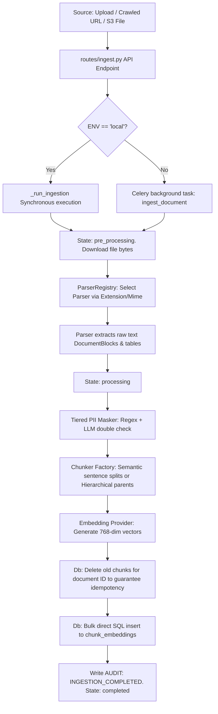
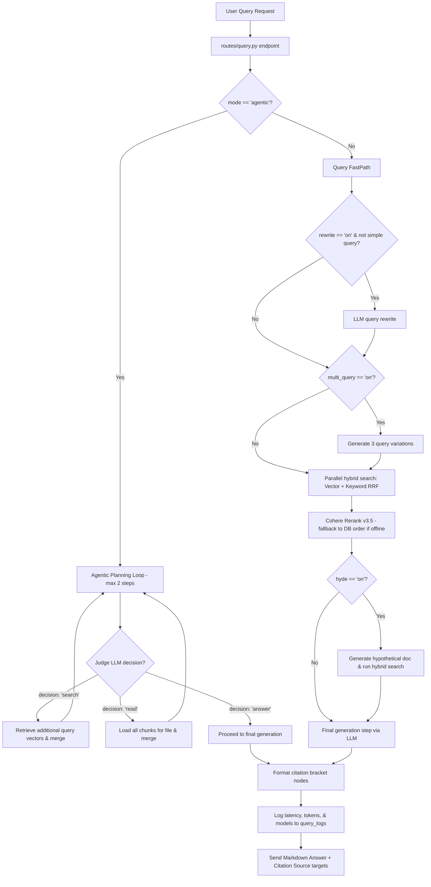
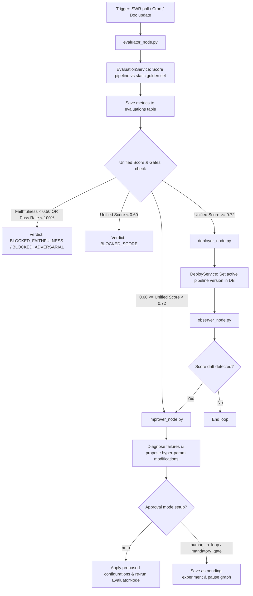
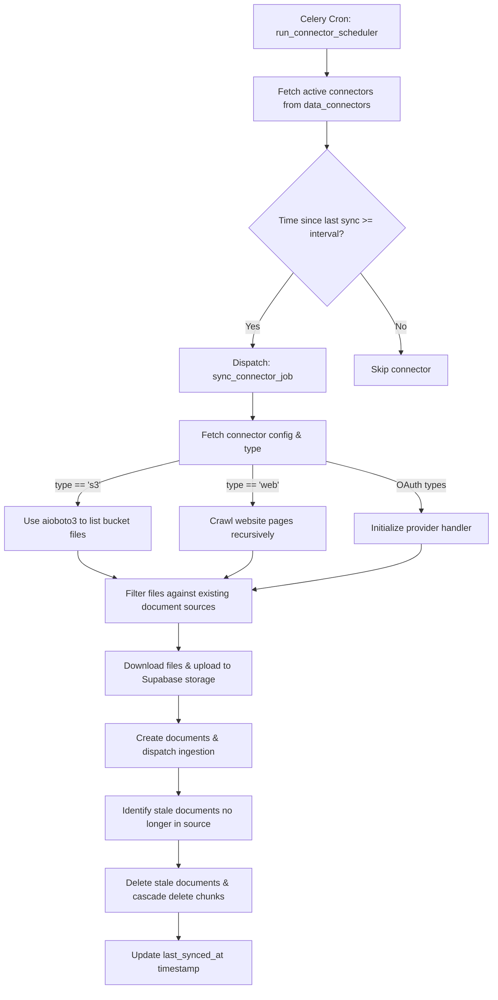
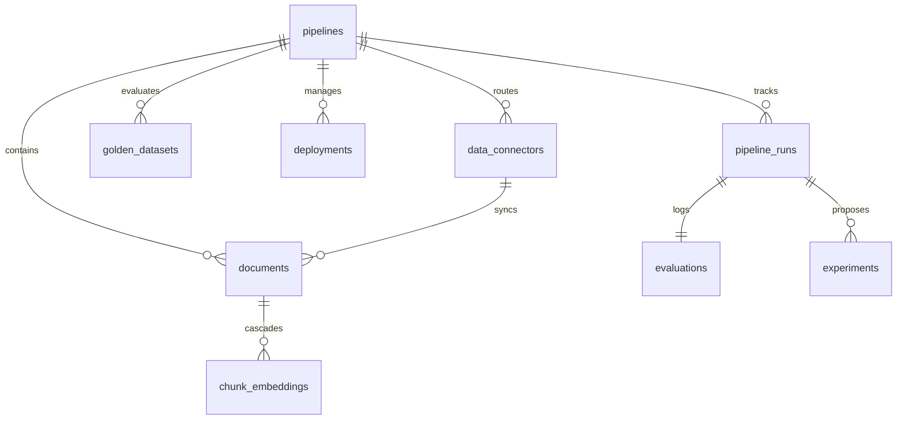

# AutoRAG — Ultimate System Architecture & Blueprint Reference Guide

This document serves as the absolute technical source of truth and comprehensive blueprint for the **AutoRAG** optimization platform. It details the system's architecture, technology stack, directory layout, operational execution loops, database schemas, scoring mathematics, tenant isolation mechanisms, frontend structure, and troubleshooting workflows.

---

## 1. Executive Summary & Core Philosophy

AutoRAG is an autonomous optimization platform designed to eliminate the manual, guess-driven process of tuning Retrieval-Augmented Generation (RAG) pipelines. Instead of manually testing variations of chunk sizes, overlap parameters, prompt structures, and retrieval models, AutoRAG automates the entire lifecycle:
1.  **Ingestion & Structuring (Flow 1)**: Asynchronously ingests raw files or site URLs, masks sensitive PII, segments documents using semantic or hierarchical chunkers, computes vector embeddings, and stores them in PostgreSQL.
2.  **FastPath Querying (Flow 2)**: Executes sub-second query resolution by orchestrating query rewriting, multi-query expansion, hybrid search (reciprocal rank fusion), Cohere reranking, HyDE (Hypothetical Document Embeddings), generation, and citation formatting. Includes an alternate **Agentic Planning Mode** to search and retrieve documents dynamically.
3.  **Autonomous Optimization (Flow 3)**: Periodically triggers evaluations against a frozen golden set, computes unified scores, diagnoses failures, proposes configuration upgrades, and deploys verified improvements.
4.  **External Connector Syncing (Flow 4)**: Automatically synchronizes files from remote S3 buckets, website domains (crawling), and cloud storage platforms (Google Drive, Notion, Dropbox, OneDrive, SharePoint) in a mirrored fashion (propagating deletions).

### Architecture Philosophies
*   **Vertical Slices**: Code is organized into end-to-end operational slices (e.g., Ingestion → FastPath Query → Evaluator) rather than split across disconnected architectural tiers.
*   **No-ORM Philosophy**: To achieve maximum performance, vector search operations, reciprocal rank calculations, and batch ingestion processes bypass ORMs and communicate directly with PostgreSQL via `asyncpg`. Standard CRUD operations on configurations use the `supabase-py` client wrapper.
*   **Tamper-Proof Auditing**: The `audit_log` table is protected by PostgreSQL rules (`DO INSTEAD NOTHING` on updates and deletes) to guarantee an immutable log of system events.

---

## 2. Technology Stack & Integrations

The platform is split into a high-performance asynchronous Python backend and a responsive Next.js frontend dashboard.

| Layer | Component | Version / Spec | Role & Responsibility |
| :--- | :--- | :--- | :--- |
| **Backend** | Python | `3.12` | Runtime engine for FastAPI, Celery, and LangGraph. |
| **HTTP API** | FastAPI + Uvicorn | `0.111+` | Hosts RESTful endpoints, API router, and FastPath querying. |
| **Task Queue** | Celery + Redis | `Celery 5.4` / `Redis 7` | Manages background ingestion, evaluation runs, and connectors. |
| **Orchestrator** | LangGraph | `0.1+` | Orchestrates the state-saved optimization loop state machine. |
| **Database** | Supabase (PostgreSQL) | `PostgreSQL 16` | Relational tables for configurations, runs, and audit logs. |
| **Vector Index** | `pgvector` (HNSW) | `768 dimensions` | Cosine distance HNSW indexes for document chunk embeddings. |
| **Text Index** | PostgreSQL `tsvector` | `english` language | GIN index on text content for keyword BM25 queries. |
| **Embeddings** | Gemini Embedding | `gemini-embedding-001` | Generates 768-dimension vectors for query and chunk retrieval. |
| **Primary LLM** | Gemini Pro | `gemini-2.5-pro` | Core model for evaluation judges and reasoning nodes. |
| **Fast LLM** | Gemini Flash | `gemini-2.5-flash` | Resolves query rewrites, HyDE docs, and fast completions. |
| **Fallback LLM** | OpenAI GPT-4o | `gpt-4o` | Acts as fallback in case of Gemini rate limit / timeout failures. |
| **Reranking** | Cohere Rerank | `rerank-v3.5` | Re-orders retrieved chunks. Gracefully falls back to RRF. |
| **Telemetry** | Langfuse | `Cloud / Host` | Captures end-to-end spans, prompt trees, and cost metrics. |
| **Frontend** | Next.js App Router | `15` | Multi-tenant administration dashboard. |
| **Styling** | Vanilla CSS + Tailwind | CSS variables | Curated dark-mode theme using emerald accents. |
| **State Fetch** | SWR | `2.x` | Coordinates browser caching and auto-polling. |

### Development Execution Presets
To facilitate development, setting `ENV=local` bypasses the Celery background worker daemon entirely. In this mode, document ingestion and optimization evaluations run synchronously in-thread, allowing local testing without active Celery or Redis services.

---

## 3. Comprehensive Directory & File Structure Map

Below is a detailed inventory of every folder and file in the codebase, outlining their core responsibilities.

### 3.1 Backend Layout

*   [backend/](file:///c:/Users/ashish/Desktop/Profile_project/Auto_Rag/AutoRAG/backend) — FastAPI app, task queue, and database migrations.
    *   [alembic/](file:///c:/Users/ashish/Desktop/Profile_project/Auto_Rag/AutoRAG/backend/alembic) — Database schema migration history.
        *   [env.py](file:///c:/Users/ashish/Desktop/Profile_project/Auto_Rag/AutoRAG/backend/alembic/env.py) — Configures connection pools and binds DB metadata to SQL engines.
        *   [versions/](file:///c:/Users/ashish/Desktop/Profile_project/Auto_Rag/AutoRAG/backend/alembic/versions) — Sequential migration files.
            *   [0001_initial_schema.py](file:///c:/Users/ashish/Desktop/Profile_project/Auto_Rag/AutoRAG/backend/alembic/versions/0001_initial_schema.py) — Creates primary tables (`pipelines`, `documents`, `chunk_embeddings`, `pipeline_runs`, `golden_datasets`, `evaluations`, `experiments`, `deployments`, `audit_log`, `query_logs`).
            *   [0002_vector_indexes_and_rrf.py](file:///c:/Users/ashish/Desktop/Profile_project/Auto_Rag/AutoRAG/backend/alembic/versions/0002_vector_indexes_and_rrf.py) — Registers pgvector HNSW cosine index, GIN text search index, and the first `hybrid_search_rrf()` function.
            *   [0003_add_document_pipeline_enhancements.py](file:///c:/Users/ashish/Desktop/Profile_project/Auto_Rag/AutoRAG/backend/alembic/versions/0003_add_document_pipeline_enhancements.py) — Adds `mime_type` to documents, and `source_type` / `media_path` columns to chunk embeddings.
            *   [0004_add_metadata_filtering.py](file:///c:/Users/ashish/Desktop/Profile_project/Auto_Rag/AutoRAG/backend/alembic/versions/0004_add_metadata_filtering.py) — Adds JSONB metadata column and GIN index to chunk embeddings, and updates the `hybrid_search_rrf()` function to support JSONB containment filtering (`@>`).
            *   [0005_add_data_connectors.py](file:///c:/Users/ashish/Desktop/Profile_project/Auto_Rag/AutoRAG/backend/alembic/versions/0005_add_data_connectors.py) — Creates the `data_connectors` table for S3/Web crawlers and binds document ingestion roots to active connectors.
    *   [app/](file:///c:/Users/ashish/Desktop/Profile_project/Auto_Rag/AutoRAG/backend/app) — Core codebase package.
        *   [main.py](file:///c:/Users/ashish/Desktop/Profile_project/Auto_Rag/AutoRAG/backend/app/main.py) — Entry point. Instantiates FastAPI, applies CORS configurations, mounts route handlers, and sets up startup/shutdown connection lifespans.
        *   [config.py](file:///c:/Users/ashish/Desktop/Profile_project/Auto_Rag/AutoRAG/backend/app/config.py) — Pydantic Settings class that loads `.env` variables (database URLs, API tokens, model preferences, and OAuth credentials).
        *   [constants.py](file:///c:/Users/ashish/Desktop/Profile_project/Auto_Rag/AutoRAG/backend/app/constants.py) — Project-wide numeric thresholds, weights, and rules (RAGAS fallback models, evaluation weights, latency penalty bands, and refusal phrases).
        *   [db.py](file:///c:/Users/ashish/Desktop/Profile_project/Auto_Rag/AutoRAG/backend/app/db.py) — Singletons managing Supabase client initialization and the `asyncpg` database connection pool.
        *   [dependencies.py](file:///c:/Users/ashish/Desktop/Profile_project/Auto_Rag/AutoRAG/backend/app/dependencies.py) — Dependency injection providers for REST routers (e.g. repos, services, and multi-tenant JWT extraction `get_tenant_context()`).
        *   [exceptions.py](file:///c:/Users/ashish/Desktop/Profile_project/Auto_Rag/AutoRAG/backend/app/exceptions.py) — Custom exception declarations (e.g. `LLMFailoverExhaustedError`, database connection errors).
        *   [logging_config.py](file:///c:/Users/ashish/Desktop/Profile_project/Auto_Rag/AutoRAG/backend/app/logging_config.py) — Structlog/JSON configuration for production-ready tracing.
        *   [models.py](file:///c:/Users/ashish/Desktop/Profile_project/Auto_Rag/AutoRAG/backend/app/models.py) — Pydantic representation schemas and system Enums.
        *   [parsers/](file:///c:/Users/ashish/Desktop/Profile_project/Auto_Rag/AutoRAG/backend/app/parsers) — Extracts text blocks and tables from raw documents.
            *   [base.py](file:///c:/Users/ashish/Desktop/Profile_project/Auto_Rag/AutoRAG/backend/app/parsers/base.py) — Defines `DocumentBlock` schema and the `DocumentParser` base interface.
            *   [pdf.py](file:///c:/Users/ashish/Desktop/Profile_project/Auto_Rag/AutoRAG/backend/app/parsers/pdf.py) — Page-by-page text extraction via PyMuPDF (`fitz`), falling back to `pypdf`. Extracts data tables page-by-page using `pdfplumber` to format them into Markdown tables.
            *   [docx.py](file:///c:/Users/ashish/Desktop/Profile_project/Auto_Rag/AutoRAG/backend/app/parsers/docx.py) — Extracts text sections and structure elements from Microsoft Word documents.
            *   [pptx.py](file:///c:/Users/ashish/Desktop/Profile_project/Auto_Rag/AutoRAG/backend/app/parsers/pptx.py) — Extracts slide text blocks and structured lists.
            *   [html.py](file:///c:/Users/ashish/Desktop/Profile_project/Auto_Rag/AutoRAG/backend/app/parsers/html.py) — Cleans scripts, styles, forms, and headers. Extracts HTML lists and tables, formatting tables into Markdown rows.
            *   [csv.py](file:///c:/Users/ashish/Desktop/Profile_project/Auto_Rag/AutoRAG/backend/app/parsers/csv.py) — Parses comma-separated tabular files into Markdown tables.
            *   [excel.py](file:///c:/Users/ashish/Desktop/Profile_project/Auto_Rag/AutoRAG/backend/app/parsers/excel.py) — Reads spreadsheet tabs and outputs Markdown summaries.
            *   [image.py](file:///c:/Users/ashish/Desktop/Profile_project/Auto_Rag/AutoRAG/backend/app/parsers/image.py) — Uses the fast model preference (Gemini Flash) to perform OCR and generate descriptive captions for image search indexing in a single completion step.
            *   [youtube.py](file:///c:/Users/ashish/Desktop/Profile_project/Auto_Rag/AutoRAG/backend/app/parsers/youtube.py) — Parses JSON subtitle segments into chunks of ~120 words or 60s, linking each block to a timestamped URL watch target.
            *   [text.py](file:///c:/Users/ashish/Desktop/Profile_project/Auto_Rag/AutoRAG/backend/app/parsers/text.py) — Fallback reader for text files.
            *   [registry.py](file:///c:/Users/ashish/Desktop/Profile_project/Auto_Rag/AutoRAG/backend/app/parsers/registry.py) — Map mime-types and file extensions to their corresponding parser instances.
        *   [chunkers/](file:///c:/Users/ashish/Desktop/Profile_project/Auto_Rag/AutoRAG/backend/app/chunkers) — Segments parsed text blocks into search-ready sizes.
            *   [base.py](file:///c:/Users/ashish/Desktop/Profile_project/Auto_Rag/AutoRAG/backend/app/chunkers/base.py) — Chunker base interface.
            *   [factory.py](file:///c:/Users/ashish/Desktop/Profile_project/Auto_Rag/AutoRAG/backend/app/chunkers/factory.py) — Spawns semantic or hierarchical segmenters based on strategy config.
            *   [semantic.py](file:///c:/Users/ashish/Desktop/Profile_project/Auto_Rag/AutoRAG/backend/app/chunkers/semantic.py) — Groups text into paragraphs. Splitting occurs on sentence boundaries when paragraph size exceeds constraints. Features token overlapping and keeps tables intact.
            *   [hierarchical.py](file:///c:/Users/ashish/Desktop/Profile_project/Auto_Rag/AutoRAG/backend/app/chunkers/hierarchical.py) — Generates large parent blocks (individual paragraphs) and corresponding child segments. Keeps tables intact.
        *   [routes/](file:///c:/Users/ashish/Desktop/Profile_project/Auto_Rag/AutoRAG/backend/app/routes) — API Endpoint routers.
            *   [pipelines.py](file:///c:/Users/ashish/Desktop/Profile_project/Auto_Rag/AutoRAG/backend/app/routes/pipelines.py) — CRUD operations for pipeline configurations.
            *   [ingest.py](file:///c:/Users/ashish/Desktop/Profile_project/Auto_Rag/AutoRAG/backend/app/routes/ingest.py) — Receives file uploads and website URLs, registers documents, and triggers the ingestion pipeline.
            *   [query.py](file:///c:/Users/ashish/Desktop/Profile_project/Auto_Rag/AutoRAG/backend/app/routes/query.py) — Exposes query FastPath (both normal and agentic modes).
            *   [evaluate.py](file:///c:/Users/ashish/Desktop/Profile_project/Auto_Rag/AutoRAG/backend/app/routes/evaluate.py) — Triggers optimization runs and fetches active progress.
            *   [deploy.py](file:///c:/Users/ashish/Desktop/Profile_project/Auto_Rag/AutoRAG/backend/app/routes/deploy.py) — Handles manual deployment activations and rollback triggers.
            *   [connectors.py](file:///c:/Users/ashish/Desktop/Profile_project/Auto_Rag/AutoRAG/backend/app/routes/connectors.py) — Manages S3 and Web connector integrations.
        *   [services/](file:///c:/Users/ashish/Desktop/Profile_project/Auto_Rag/AutoRAG/backend/app/services) — Core business logic layer.
            *   [llm/](file:///c:/Users/ashish/Desktop/Profile_project/Auto_Rag/AutoRAG/backend/app/services/llm) — Interfaces with LLM providers.
                *   [base.py](file:///c:/Users/ashish/Desktop/Profile_project/Auto_Rag/AutoRAG/backend/app/services/llm/base.py) — Model completion provider interface.
                *   [gemini.py](file:///c:/Users/ashish/Desktop/Profile_project/Auto_Rag/AutoRAG/backend/app/services/llm/gemini.py) — Google Gemini API gateway client.
                *   [openai.py](file:///c:/Users/ashish/Desktop/Profile_project/Auto_Rag/AutoRAG/backend/app/services/llm/openai.py) — OpenAI and Euron OpenAI-compatible gateway client.
                *   [service.py](file:///c:/Users/ashish/Desktop/Profile_project/Auto_Rag/AutoRAG/backend/app/services/llm/service.py) — Circuit breaker and failover coordinator (e.g. Gemini Pro → GPT-4o fallback).
            *   [embedding/](file:///c:/Users/ashish/Desktop/Profile_project/Auto_Rag/AutoRAG/backend/app/services/embedding) — Computes vector representations for queries and document chunks.
            *   [pii/](file:///c:/Users/ashish/Desktop/Profile_project/Auto_Rag/AutoRAG/backend/app/services/pii) — PII Sanitization.
                *   [patterns.py](file:///c:/Users/ashish/Desktop/Profile_project/Auto_Rag/AutoRAG/backend/app/services/pii/patterns.py) — Regular expressions for SSNs, credit cards, phone numbers, IPs, and email addresses.
                *   [service.py](file:///c:/Users/ashish/Desktop/Profile_project/Auto_Rag/AutoRAG/backend/app/services/pii/service.py) — Tier 1 (regex + Luhn credit card validation) and Tier 2 (Gemini Flash fallback for names and addresses) PII masking.
            *   [query_service.py](file:///c:/Users/ashish/Desktop/Profile_project/Auto_Rag/AutoRAG/backend/app/services/query_service.py) — Implements synchronous query resolving pipelines, support tags, multi-query expansion, and the 2-step agentic planning loop.
            *   [evaluation_service.py](file:///c:/Users/ashish/Desktop/Profile_project/Auto_Rag/AutoRAG/backend/app/services/evaluation_service.py) — Evaluates pipelines against golden datasets. Computes unified metrics, context precision, context recall, latencies, and adversarial pass rates.
            *   [deploy_service.py](file:///c:/Users/ashish/Desktop/Profile_project/Auto_Rag/AutoRAG/backend/app/services/deploy_service.py) — Controls pipeline deployment state promotions and rollbacks.
            *   [approval_service.py](file:///c:/Users/ashish/Desktop/Profile_project/Auto_Rag/AutoRAG/backend/app/services/approval_service.py) — Performs parameter diff assessments and routes configuration changes to the appropriate approval tier (Auto, Human in the Loop, Mandatory Gate).
            *   [audit_service.py](file:///c:/Users/ashish/Desktop/Profile_project/Auto_Rag/AutoRAG/backend/app/services/audit_service.py) — Logs pipeline updates, masking, runs, and deployments while stripping sensitive information.
            *   [connector_service.py](file:///c:/Users/ashish/Desktop/Profile_project/Auto_Rag/AutoRAG/backend/app/services/connector_service.py) — Manages CRUD operations for remote connectors and dispatches manual sync jobs.
        *   [repositories/](file:///c:/Users/ashish/Desktop/Profile_project/Auto_Rag/AutoRAG/backend/app/repositories) — Directly executes optimized SQL queries on PostgreSQL.
            *   [base.py](file:///c:/Users/ashish/Desktop/Profile_project/Auto_Rag/AutoRAG/backend/app/repositories/base.py) — Core repository helpers.
            *   [chunk_repo.py](file:///c:/Users/ashish/Desktop/Profile_project/Auto_Rag/AutoRAG/backend/app/repositories/chunk_repo.py) — Handles bulk vector ingestion and triggers the `hybrid_search_rrf()` function.
            *   [pipeline_repo.py](file:///c:/Users/ashish/Desktop/Profile_project/Auto_Rag/AutoRAG/backend/app/repositories/pipeline_repo.py) — Reads configurations and updates active deployment flags.
            *   [document_repo.py](file:///c:/Users/ashish/Desktop/Profile_project/Auto_Rag/AutoRAG/backend/app/repositories/document_repo.py) — Tracks ingestion states and sizes.
        *   [retrieval/](file:///c:/Users/ashish/Desktop/Profile_project/Auto_Rag/AutoRAG/backend/app/retrieval) — Manages search execution.
            *   [hybrid.py](file:///c:/Users/ashish/Desktop/Profile_project/Auto_Rag/AutoRAG/backend/app/retrieval/hybrid.py) — Retrieves vectors and text in parallel, combining them via database RRF.
            *   [hyde.py](file:///c:/Users/ashish/Desktop/Profile_project/Auto_Rag/AutoRAG/backend/app/retrieval/hyde.py) — Generates hypothetical answers to expand query retrieval scope.
            *   [reranker.py](file:///c:/Users/ashish/Desktop/Profile_project/Auto_Rag/AutoRAG/backend/app/retrieval/reranker.py) — Integrates Cohere Command Reranking, falling back to database RRF if offline.
        *   [graph/](file:///c:/Users/ashish/Desktop/Profile_project/Auto_Rag/AutoRAG/backend/app/graph) — LangGraph optimization graph loop.
            *   [state.py](file:///c:/Users/ashish/Desktop/Profile_project/Auto_Rag/AutoRAG/backend/app/graph/state.py) — Defines OptimizationState variables, approval tiers, and diagnostic attributes.
            *   [workflow.py](file:///c:/Users/ashish/Desktop/Profile_project/Auto_Rag/AutoRAG/backend/app/graph/workflow.py) — Sets up the optimization workflow graph structure and conditional edges.
            *   [nodes/](file:///c:/Users/ashish/Desktop/Profile_project/Auto_Rag/AutoRAG/backend/app/graph/nodes) — Graph execution nodes.
                *   [evaluator.py](file:///c:/Users/ashish/Desktop/Profile_project/Auto_Rag/AutoRAG/backend/app/graph/nodes/evaluator.py) — Performs golden set evaluation runs.
                *   [improver.py](file:///c:/Users/ashish/Desktop/Profile_project/Auto_Rag/AutoRAG/backend/app/graph/nodes/improver.py) — Proposes configuration upgrades based on diagnostics, handles auto-approval, and creates experiments.
                *   [deployer.py](file:///c:/Users/ashish/Desktop/Profile_project/Auto_Rag/AutoRAG/backend/app/graph/nodes/deployer.py) — Promotes validated config changes to production.
                *   [observer.py](file:///c:/Users/ashish/Desktop/Profile_project/Auto_Rag/AutoRAG/backend/app/graph/nodes/observer.py) — Identifies system drift based on previous evaluation runs.
        *   [workers/](file:///c:/Users/ashish/Desktop/Profile_project/Auto_Rag/AutoRAG/backend/app/workers) — Background task runners and crons.
            *   [celery_app.py](file:///c:/Users/ashish/Desktop/Profile_project/Auto_Rag/AutoRAG/backend/app/workers/celery_app.py) — Bootstraps Celery and registers task pathways.
            *   [ingest_task.py](file:///c:/Users/ashish/Desktop/Profile_project/Auto_Rag/AutoRAG/backend/app/workers/ingest_task.py) — Celery task managing the ingestion pipeline.
            *   [evaluate_task.py](file:///c:/Users/ashish/Desktop/Profile_project/Auto_Rag/AutoRAG/backend/app/workers/evaluate_task.py) — Celery task managing evaluations.
            *   [connector_task.py](file:///c:/Users/ashish/Desktop/Profile_project/Auto_Rag/AutoRAG/backend/app/workers/connector_task.py) — Synchronizes S3 prefixes, crawls websites, and delegates files to the ingestion queue. Handles deletion syncing.
            *   [connector_cron.py](file:///c:/Users/ashish/Desktop/Profile_project/Auto_Rag/AutoRAG/backend/app/workers/connector_cron.py) — Scheduled background task that identifies active connectors that need syncing.
            *   [observer_cron.py](file:///c:/Users/ashish/Desktop/Profile_project/Auto_Rag/AutoRAG/backend/app/workers/observer_cron.py) — Scheduled background task that checks for metric drift and triggers evaluations when needed.

### 3.2 Frontend Layout

*   [frontend/](file:///c:/Users/ashish/Desktop/Profile_project/Auto_Rag/AutoRAG/frontend) — Next.js 15 App Router web application.
    *   [src/](file:///c:/Users/ashish/Desktop/Profile_project/Auto_Rag/AutoRAG/frontend/src) — Source root directory.
        *   [app/](file:///c:/Users/ashish/Desktop/Profile_project/Auto_Rag/AutoRAG/frontend/src/app) — Layout routes.
            *   [globals.css](file:///c:/Users/ashish/Desktop/Profile_project/Auto_Rag/AutoRAG/frontend/src/app/globals.css) — Custom global CSS rules, tailwind overrides, glassmorphic filters, and background gradient maps.
            *   [layout.tsx](file:///c:/Users/ashish/Desktop/Profile_project/Auto_Rag/AutoRAG/frontend/src/app/layout.tsx) — Root layout definition containing metadata elements.
            *   [(dashboard)/](file:///c:/Users/ashish/Desktop/Profile_project/Auto_Rag/AutoRAG/frontend/src/app/\(dashboard\)) — Authenticated console screens.
                *   [layout.tsx](file:///c:/Users/ashish/Desktop/Profile_project/Auto_Rag/AutoRAG/frontend/src/app/\(dashboard\)/layout.tsx) — Renders the main dashboard layout with the collapsible Sidebar drawer navigation.
                *   [dashboard/](file:///c:/Users/ashish/Desktop/Profile_project/Auto_Rag/AutoRAG/frontend/src/app/\(dashboard\)/dashboard) — System status overview, step-by-step setup guides, and live audit timeline feeds.
                *   [pipelines/](file:///c:/Users/ashish/Desktop/Profile_project/Auto_Rag/AutoRAG/frontend/src/app/\(dashboard\)/pipelines) — Interface to manage, update, and deploy pipeline parameters.
                *   [documents/](file:///c:/Users/ashish/Desktop/Profile_project/Auto_Rag/AutoRAG/frontend/src/app/\(dashboard\)/documents) — Upload dashboard displaying real-time processing timelines.
                *   [playground/](file:///c:/Users/ashish/Desktop/Profile_project/Auto_Rag/AutoRAG/frontend/src/app/\(dashboard\)/playground) — Chat sandbox for query testing, featuring interactive reference lookup drawers.
                *   [evaluations/](file:///c:/Users/ashish/Desktop/Profile_project/Auto_Rag/AutoRAG/frontend/src/app/\(dashboard\)/evaluations) — Displays metrics, RAGAS parameters, and failure diagnostics.
                *   [deployments/](file:///c:/Users/ashish/Desktop/Profile_project/Auto_Rag/AutoRAG/frontend/src/app/\(dashboard\)/deployments) — Displays deployment parameters, active experiments, and rollback logs.
                *   [connectors/](file:///c:/Users/ashish/Desktop/Profile_project/Auto_Rag/AutoRAG/frontend/src/app/\(dashboard\)/connectors) — Configures external S3 bucket credentials and website crawling.
        *   [components/](file:///c:/Users/ashish/Desktop/Profile_project/Auto_Rag/AutoRAG/frontend/src/components) — Reusable React components.
            *   [app-sidebar.tsx](file:///c:/Users/ashish/Desktop/Profile_project/Auto_Rag/AutoRAG/frontend/src/components/app-sidebar.tsx) — Collapsible left sidebar navigation menu.
            *   [page-header.tsx](file:///c:/Users/ashish/Desktop/Profile_project/Auto_Rag/AutoRAG/frontend/src/components/page-header.tsx) — Standard header featuring animations and action buttons.
            *   [ui/](file:///c:/Users/ashish/Desktop/Profile_project/Auto_Rag/AutoRAG/frontend/src/components/ui) — Custom design elements.
                *   [select.tsx](file:///c:/Users/ashish/Desktop/Profile_project/Auto_Rag/AutoRAG/frontend/src/components/ui/select.tsx) — Custom dropdown menu component.
                *   [score-ring.tsx](file:///c:/Users/ashish/Desktop/Profile_project/Auto_Rag/AutoRAG/frontend/src/components/ui/score-ring.tsx) — Radial SVG gauge used to display evaluation scores.
                *   [progress-bar.tsx](file:///c:/Users/ashish/Desktop/Profile_project/Auto_Rag/AutoRAG/frontend/src/components/ui/progress-bar.tsx) — Horizontal gradient progress bar.
        *   [lib/](file:///c:/Users/ashish/Desktop/Profile_project/Auto_Rag/AutoRAG/frontend/src/lib) — Utility libraries.
            *   [api.ts](file:///c:/Users/ashish/Desktop/Profile_project/Auto_Rag/AutoRAG/frontend/src/lib/api.ts) — Axios client configuration for REST calls.
            *   [types.ts](file:///c:/Users/ashish/Desktop/Profile_project/Auto_Rag/AutoRAG/frontend/src/lib/types.ts) — TypeScript interfaces matching the backend's data structures.

---

## 4. End-to-End Operational Flows & Execution Architectures

AutoRAG is structured around four primary operational loops.

### Flow 1: Asynchronous Document Ingestion Pipeline

The document ingestion loop processes uploads and URLs to generate structured chunk vector embeddings.



#### Idempotency & Re-runs
Before inserting new chunks into `chunk_embeddings`, the system executes `delete_for_document()`. This removes all existing chunk references for the document, ensuring that changing chunk size configs or parsing strategies does not result in duplicate records.

#### URL Ingest Subtypes (YouTube Transcripts vs HTML Scrapes)
When raw URL ingestion is requested through `POST /api/v1/ingest/url`, the router categorizes the source:
*   **YouTube Videos**: If the URL matches YouTube structures (e.g. Shorts, mobile, embed, or standard watch parameters), the system invokes the `youtube_transcript_api` library to fetch the subtitle segment list (`snippets` containing `text`, `start`, and `duration`). It outputs this list as JSON bytes, uploads it to storage as a `.youtube` resource, and associates it with the `YouTubeParser`.
*   **Standard Websites**: If not a YouTube URL, `httpx.AsyncClient` downloads the static HTML response (up to 15.0s timeout limit, following redirects). Filenames are normalized based on domain name and path, saved with `.html` extension, and mapped to the standard `HTMLParser`.

#### Local Storage Fallback Strategy
If a remote Supabase credentials bucket is not configured, the `StorageService` automatically redirects file operations to the local file system. To prevent thread blocking on synchronous disk operations, standard file open/read/write statements are wrapped inside async pools:
*   **Target Directory**: Paths map under a `storage/` directory in the root workspace project.
*   **Thread Delegation**: Executes disk I/O via `asyncio.to_thread()`, keeping the async event loop available to resolve other request responses.

---

### Flow 2: Query FastPath Execution (Synchronous HTTP Thread)

The Query FastPath is designed to resolve user questions within a single synchronous request thread.



#### The Agentic Planning Loop
When the search mode is set to `agentic`, the system uses `gemini-2.5-flash` to evaluate the query alongside the initial retrieved context. The model generates a JSON object matching the schema below:
```json
{
  "decision": "answer" | "search" | "read",
  "search_query": "...",
  "filename": "..."
}
```
*   **Search**: The agent requests a supplementary search. The system executes retrieval for the new search query, merges the results with the existing candidates, deduplicates them, and runs reranking.
*   **Read**: The agent requests access to a specific document. The system loads all chunks related to the document, merges them with the existing candidates, deduplicates them, and runs reranking.
*   The loop runs for a maximum of 2 iterations before generating the final answer.

---

### Flow 3: Autonomous Optimization Loop (LangGraph State Machine)

The optimization loop coordinates evaluations, diagnoses quality issues, and proposes configuration updates.



#### Edge Transition Policies
The LangGraph workflow routes updates between nodes based on the following criteria:
*   **Evaluator → End**: Unified score falls below `0.60`, or faithfulness falls below `0.50` (hard block).
*   **Evaluator → Deployer**: Unified score is $\ge$ `0.72` and the configuration is approved.
*   **Evaluator → Improver**: Unified score is between `0.60` and `0.72`.
*   **Improver → Evaluator**: A configuration update is approved. The updated parameters are evaluated against the same golden set.
*   **Observer → Improver**: The rolling evaluation score drops by more than `0.05` (5%) compared to prior averages.

---

### Flow 4: Data Connector Syncing (Celery Cron)

The connector synchronization pipeline periodically syncs external files and directory trees.



#### Mirroring Deletions (Source Tracking)
To ensure the vector index remains synchronized with external directory changes, the sync task performs a mirrored deletion check:
1.  **Enumerate active items**: Retrieves all documents associated with the specific `connector_id` in the database, creating a source mapping index.
2.  **Filter stale documents**: Identifies documents in the database that are absent in the newly retrieved source listing (e.g. deleted S3 files or removed web URLs).
3.  **Purge assets**: Deletes these items from Supabase Storage and issues a repository removal command. The deletion cascades to clear all related records in `chunk_embeddings`.

#### OAuth Callback Authorization Flows
For integrations requiring OAuth credentials (Google Drive, Notion, Dropbox, Microsoft OneDrive), `oauth.py` coordinates token exchanges:
*   **Redirect signing**: Generates redirection targets for OAuth providers. The `state` parameter is a JWT payload signed with the system's service role key containing `connector_id`, `org_id`, and `actor_id` claims, set to expire in 10 minutes.
*   **Token exchange**: Incallback verification, decrypts the `state` JWT (falling back to direct state ID mapping for local development). Exchanges the received authorization `code` for access/refresh tokens.
*   **Instant synchronization**: Saves these tokens in the connector's `config` column under `oauth_tokens` and triggers a manual synchronization task (`trigger_sync`) instantly.

---

## 5. Database Schema & SQL Stored Procedures

The database is built on PostgreSQL 16 and uses `pgvector` for vector storage and retrieval.



### 5.1 Relational Table Definitions

#### `pipelines`
Tracks system configurations and active hyper-parameter models.
```sql
CREATE TABLE pipelines (
    id                UUID PRIMARY KEY DEFAULT gen_random_uuid(),
    organization_id   UUID NOT NULL,
    name              VARCHAR(255) NOT NULL,
    description       TEXT,
    config            JSONB NOT NULL,
    chunking_strategy VARCHAR(50) NOT NULL CHECK (chunking_strategy IN ('semantic','hierarchical','auto')),
    retrieval_method  VARCHAR(50) NOT NULL DEFAULT 'hybrid' CHECK (retrieval_method IN ('dense','hybrid','hybrid_hyde')),
    llm_judge         VARCHAR(50) NOT NULL DEFAULT 'gemini-2.5-pro',
    approval_mode     VARCHAR(50) NOT NULL DEFAULT 'human_in_loop' CHECK (approval_mode IN ('auto','human_in_loop','mandatory_gate')),
    active_version    UUID,
    status            VARCHAR(30) NOT NULL DEFAULT 'draft' CHECK (status IN ('draft','active','archived')),
    created_by        UUID NOT NULL,
    created_at        TIMESTAMP WITH TIME ZONE DEFAULT NOW(),
    updated_at        TIMESTAMP WITH TIME ZONE DEFAULT NOW()
);
```

#### `documents`
Tracks document metadata and processing statuses.
```sql
CREATE TABLE documents (
    id              UUID PRIMARY KEY DEFAULT gen_random_uuid(),
    organization_id UUID NOT NULL,
    pipeline_id     UUID NOT NULL REFERENCES pipelines(id) ON DELETE CASCADE,
    connector_id    UUID REFERENCES data_connectors(id) ON DELETE CASCADE,
    source_id       VARCHAR(255),
    filename        VARCHAR(255) NOT NULL,
    file_size       BIGINT NOT NULL,
    storage_path    VARCHAR(512) NOT NULL,
    mime_type       VARCHAR(100),
    status          VARCHAR(30) NOT NULL DEFAULT 'queued' CHECK (status IN ('queued','pre_processing','processing','completed','failed','cancelled')),
    chunk_count     INTEGER NOT NULL DEFAULT 0,
    pii_entities    INTEGER NOT NULL DEFAULT 0,
    pii_tier2_run   BOOLEAN NOT NULL DEFAULT FALSE,
    error           TEXT,
    created_at      TIMESTAMP WITH TIME ZONE DEFAULT NOW(),
    updated_at      TIMESTAMP WITH TIME ZONE DEFAULT NOW()
);
```

#### `chunk_embeddings`
Stores document chunks, metadata, full-text indexes, and raw embeddings.
```sql
CREATE TABLE chunk_embeddings (
    id              UUID PRIMARY KEY DEFAULT gen_random_uuid(),
    document_id     UUID NOT NULL REFERENCES documents(id) ON DELETE CASCADE,
    pipeline_id     UUID NOT NULL REFERENCES pipelines(id) ON DELETE CASCADE,
    organization_id UUID NOT NULL,
    chunk_index     INTEGER NOT NULL,
    token_count     INTEGER NOT NULL,
    content         TEXT NOT NULL,
    embedding       vector(768) NOT NULL,
    tsv             tsvector GENERATED ALWAYS AS (to_tsvector('english', content)) STORED,
    page_number     INTEGER,
    source_type     VARCHAR(50) DEFAULT 'text' CHECK (source_type IN ('text', 'table', 'figure', 'image')),
    media_path      VARCHAR(512),
    chunk_strategy  VARCHAR(50) NOT NULL CHECK (chunk_strategy IN ('semantic','hierarchical_parent','hierarchical_child')),
    metadata        JSONB DEFAULT '{}'::jsonb NOT NULL,
    created_at      TIMESTAMP WITH TIME ZONE DEFAULT NOW()
);
```

#### `evaluations`
Logs the metrics and judges' reasoning for evaluation runs.
```sql
CREATE TABLE evaluations (
    id                  UUID PRIMARY KEY DEFAULT gen_random_uuid(),
    run_id              UUID NOT NULL REFERENCES pipeline_runs(id) ON DELETE CASCADE,
    organization_id     UUID NOT NULL,
    golden_set_id       UUID NOT NULL,
    unified_score       NUMERIC(5,4) NOT NULL,
    retrieval_score     NUMERIC(5,4) NOT NULL,
    quality_score       NUMERIC(5,4) NOT NULL,
    faithfulness_score  NUMERIC(5,4) NOT NULL,
    latency_penalty     NUMERIC(5,4) NOT NULL DEFAULT 0,
    cost_penalty        NUMERIC(5,4) NOT NULL DEFAULT 0,
    ragas_context_precision   NUMERIC(5,4),
    ragas_context_recall      NUMERIC(5,4),
    ragas_answer_faithfulness NUMERIC(5,4),
    ragas_answer_relevancy    NUMERIC(5,4),
    ragas_scorer        VARCHAR(50),
    adversarial_pass_rate     NUMERIC(5,4),
    adversarial_fail_count    INTEGER DEFAULT 0,
    deploy_eligible     BOOLEAN NOT NULL DEFAULT FALSE,
    failure_reason      TEXT,
    judge_reasoning     TEXT,
    eval_duration_ms    INTEGER,
    created_at          TIMESTAMP WITH TIME ZONE DEFAULT NOW()
);
```

#### `audit_log`
An append-only audit trail. Updates and deletes are blocked.
```sql
CREATE TABLE audit_log (
    id              UUID PRIMARY KEY DEFAULT gen_random_uuid(),
    organization_id UUID NOT NULL,
    event_type      VARCHAR(50) NOT NULL CHECK (event_type IN (
                        'PIPELINE_CREATED','PIPELINE_UPDATED',
                        'INGESTION_STARTED','INGESTION_COMPLETED',
                        'DOCUMENT_STATUS_CHANGED',
                        'EVALUATION_STARTED','EVALUATION_COMPLETED',
                        'IMPROVEMENT_TRIGGERED',
                        'APPROVAL_GRANTED','APPROVAL_DENIED',
                        'PIPELINE_DEPLOYED','PIPELINE_ROLLED_BACK'
                    )),
    actor_id        UUID NOT NULL,
    resource_type   VARCHAR(50) NOT NULL,
    resource_id     UUID NOT NULL,
    trace_id        UUID NOT NULL,
    payload         JSONB,
    ip_address      INET,
    created_at      TIMESTAMP WITH TIME ZONE DEFAULT NOW()
);

-- Locking rules
CREATE RULE audit_log_no_update AS ON UPDATE TO audit_log DO INSTEAD NOTHING;
CREATE RULE audit_log_no_delete AS ON DELETE TO audit_log DO INSTEAD NOTHING;
```

#### `data_connectors`
Tracks external data source sync configurations.
```sql
CREATE TABLE data_connectors (
    id UUID PRIMARY KEY,
    organization_id UUID NOT NULL,
    pipeline_id UUID NOT NULL REFERENCES pipelines(id) ON DELETE CASCADE,
    name VARCHAR(255) NOT NULL,
    type VARCHAR(50) NOT NULL,
    config JSONB NOT NULL,
    status VARCHAR(50) DEFAULT 'active' CHECK (status IN ('active', 'paused', 'error')),
    last_synced_at TIMESTAMP WITH TIME ZONE,
    sync_interval_minutes INT DEFAULT 60,
    created_at TIMESTAMP WITH TIME ZONE DEFAULT NOW(),
    updated_at TIMESTAMP WITH TIME ZONE DEFAULT NOW()
);
```

---

### 5.2 Reciprocal Rank Fusion Stored Procedure

Vector similarity and full-text keyword searches are combined in the database via the `hybrid_search_rrf()` function.

```sql
CREATE OR REPLACE FUNCTION hybrid_search_rrf(
    query_text      TEXT,
    query_emb       vector(768),
    pipeline_uuid   UUID,
    match_limit     INT DEFAULT 20,
    k               INT DEFAULT 60,
    metadata_filter JSONB DEFAULT NULL
)
RETURNS TABLE (chunk_id UUID, content TEXT, rrf_score NUMERIC)
LANGUAGE sql STABLE AS $$
  WITH dense AS (
    SELECT id,
           ROW_NUMBER() OVER (ORDER BY embedding <=> query_emb) AS rnk
    FROM chunk_embeddings
    WHERE pipeline_id = pipeline_uuid
      AND (metadata_filter IS NULL OR metadata @> metadata_filter)
    ORDER BY embedding <=> query_emb
    LIMIT match_limit * 2
  ),
  keyword AS (
    SELECT id,
           ROW_NUMBER() OVER (
             ORDER BY ts_rank(tsv, plainto_tsquery('english', query_text)) DESC
           ) AS rnk
    FROM chunk_embeddings
    WHERE pipeline_id = pipeline_uuid
      AND tsv @@ plainto_tsquery('english', query_text)
      AND (metadata_filter IS NULL OR metadata @> metadata_filter)
    ORDER BY ts_rank(tsv, plainto_tsquery('english', query_text)) DESC
    LIMIT match_limit * 2
  ),
  fused AS (
    SELECT COALESCE(d.id, kw.id) AS id,
           COALESCE(1.0 / (k + d.rnk), 0) + COALESCE(1.0 / (k + kw.rnk), 0) AS score
    FROM dense d
    FULL OUTER JOIN keyword kw ON d.id = kw.id
  )
  SELECT c.id, c.content, f.score::NUMERIC AS rrf_score
  FROM fused f
  JOIN chunk_embeddings c ON c.id = f.id
  ORDER BY f.score DESC
  LIMIT match_limit;
$$;
```

#### Why it is fast:
1.  **HNSW Indexing**: The `idx_chunk_embeddings_cosine` index (`embedding vector_cosine_ops`) accelerates dense vector comparisons.
2.  **GIN Indexing**: The full-text search column uses a GIN index (`idx_chunk_embeddings_tsv`).
3.  **JSONB Containment**: The metadata filter uses the JSONB containment operator (`@>`), which utilizes the GIN metadata index (`idx_chunk_embeddings_metadata`) to filter chunks in milliseconds.

### 5.3 Hard-Deletion Dependency Workaround Transaction
Because the database foreign keys are configured with `NO ACTION` instead of `ON DELETE CASCADE` (except for `data_connectors` and document-cascade embeddings), deleting a pipeline requires a strict transactional ordering. The `PipelineRepository` executes the following sequence inside a single database transaction block:
1.  **Delete evaluations**: Removes rows from `evaluations` referencing `pipeline_runs` for this pipeline.
2.  **Delete experiments**: Removes rows from `experiments` where `run_id` or `parent_run_id` references runs belonging to this pipeline.
3.  **Break self-reference on deployments**: Sets `previous_deployment = NULL` for all deployments belonging to this pipeline (prevents FK blocker).
4.  **Delete deployments**: Removes all deployments for this pipeline.
5.  **Delete query logs**: Removes rows from `query_logs`.
6.  **Delete golden datasets**: Removes rows from `golden_datasets`.
7.  **Delete chunk embeddings**: Removes rows from `chunk_embeddings`.
8.  **Delete documents**: Removes rows from `documents`.
9.  **Delete pipeline runs**: Removes rows from `pipeline_runs`.
10. **Delete pipeline**: Removes the parent config row from `pipelines`.

### 5.4 Null-Byte Encoding Sanitizer Shield
PostgreSQL raises encoding exceptions when processing string literals containing null bytes (`0x00` / `\x00`). To prevent ingestion and status failures when parsing corrupted documents or external logs, the `DocumentRepository` runs a sanitizing filter on `filename`, `storage_path`, and `error` parameters prior to database operations:
```python
filename_clean = row["filename"].replace("\x00", "").replace("\u0000", "")
storage_path_clean = row["storage_path"].replace("\x00", "").replace("\u0000", "") if row.get("storage_path") else None
error_clean = error.replace("\x00", "").replace("\u0000", "") if error else None
```

---

## 6. Score Metric Math & Decision Gates

### 6.1 Mathematical Formulations

#### 1. The Unified Score index
The overall quality of a configuration is determined by the following formula:
$$\text{Unified Score} = 0.25 \cdot \text{Retrieval} + 0.35 \cdot \text{Quality} + 0.25 \cdot \text{Faithfulness} - 0.10 \cdot \text{Latency Penalty} - 0.05 \cdot \text{Cost Penalty}$$
*   **Retrieval**: The percentage of expected chunks present in the top-k retrieved list.
*   **Quality**: The average of context precision and answer relevancy:
    $$\text{Quality} = \frac{\text{Context Precision} + \text{Answer Relevancy}}{2}$$

#### 2. Context Precision (Rank-Aware AP)
Measures the rank relevance of retrieved chunks, rewarding cases where expected chunks are positioned at the top of the results:
$$\text{Context Precision} = \frac{1}{\min(|E|, 1)} \sum_{r=1}^{K} P(r) \cdot \mathbb{I}(c_r \in E)$$
*   $E$ represents the expected chunk ID set.
*   $P(r)$ represents precision at rank $r$ (number of valid hits up to rank $r$ divided by $r$).
*   $\mathbb{I}(c_r \in E)$ is an indicator function returning 1 if the chunk at rank $r$ is expected, and 0 otherwise.

#### 3. Latency Penalty
Penalties are applied based on median evaluation latencies:
$$\text{Latency Penalty} = \begin{cases} 
      0.0 & \text{median latency} \le 8000\text{ms} \\
      0.5 & 8000\text{ms} < \text{median latency} \le 15000\text{ms} \\
      1.0 & \text{median latency} > 15000\text{ms}
   \end{cases}$$

---

### 6.2 Decision Gate Policies

Configurations are promoted, reviewed, or blocked based on the following rules:

*   **DEPLOY**: Eligible for automatic promotion to production. Requires:
    $$\text{Unified Score} \ge 0.72 \quad \text{AND} \quad \text{Faithfulness} \ge 0.50 \quad \text{AND} \quad \text{Adversarial Pass Rate} = 1.0 \quad (100\%)$$
*   **IMPROVE**: Triggers configuration modifications. Proposes updates when:
    $$0.60 \le \text{Unified Score} < 0.72 \quad \text{AND} \quad \text{Faithfulness} \ge 0.50$$
*   **BLOCKED**: Config updates are blocked if:
    $$\text{Unified Score} < 0.60 \quad \text{OR} \quad \text{Faithfulness} < 0.50 \quad \text{OR} \quad \text{Adversarial Pass Rate} < 1.0$$

---

## 7. Security, Tenant Context, & Auditing

### 7.1 Multi-Tenant Context Injection

Tenants are isolated at the request level via the `get_tenant_context()` dependency.

```python
async def get_tenant_context(request: Request) -> TenantContext:
    auth_header = request.headers.get("Authorization")
    org_id = uuid.UUID(int=0)
    actor_id = uuid.UUID(int=0)
    
    if auth_header and auth_header.startswith("Bearer "):
        token = auth_header.split(" ")[1]
        try:
            # Decode token to extract claims (signature verification is bypassed for local dev workflows)
            decoded = jwt.decode(token, options={"verify_signature": False})
            
            if "org_id" in decoded:
                org_id = uuid.UUID(decoded["org_id"])
            elif "user_metadata" in decoded and "org_id" in decoded["user_metadata"]:
                org_id = uuid.UUID(decoded["user_metadata"]["org_id"])
            elif "app_metadata" in decoded and "org_id" in decoded["app_metadata"]:
                org_id = uuid.UUID(decoded["app_metadata"]["org_id"])
                
            if "sub" in decoded:
                actor_id = uuid.UUID(decoded["sub"])
        except Exception:
            pass
            
    return TenantContext(organization_id=org_id, actor_id=actor_id)
```
The database indexes the `organization_id` column across all tables. Queries include `organization_id` filters to prevent cross-tenant data leakage.

### 7.2 Audit Trail Immutability
The append-only status of the `audit_log` table is enforced at the database level using rewrite rules:
```sql
CREATE RULE audit_log_no_update AS ON UPDATE TO audit_log DO INSTEAD NOTHING;
CREATE RULE audit_log_no_delete AS ON DELETE TO audit_log DO INSTEAD NOTHING;
```
Before audit payloads are saved, they are filtered to strip out sensitive data keys like `email`, `phone`, `ssn`, `credit_card`, and `ip`.

---

## 8. Frontend Custom Components & Layout Routing

The dashboard interface is built using Next.js 15, using Tailwind CSS and CSS Variables for styling.

### 8.1 Layout & Navigation Tree
*   `/dashboard`: High-level system overview. Displays document volumes, operational statuses, setup guides, and scoring history charts.
*   `/pipelines`: Configuration portal. Allows developers to manage chunking strategies, retrieval methods, evaluation judges, and automation settings.
*   `/documents`: Document ingestion portal. Features drag-and-drop file uploading and displays processing statuses.
*   `/playground`: Chat sandbox. Features markdown completions, query histories, and interactive citation drawers.
*   `/evaluations`: Displays radial gauges, metrics breakdowns, and diagnostic notifications.
*   `/deployments`: Operations dashboard. Allows developers to activate configurations, verify differences between variants, and initiate rollbacks.
*   `/connectors`: Connector portal. Configures sync intervals and credentials for S3 bucket syncs and website crawling.

### 8.2 Shared UI Components
*   `ScoreRing` (`score-ring.tsx`): A radial SVG gauge that animates evaluation scores and adjusts color schemes based on performance thresholds (e.g. green $\ge$ 72%, amber $\ge$ 60%, red < 60%).
*   `ProgressBar` (`progress-bar.tsx`): Renders horizontal gradients that track sub-metrics.
*   `Select` (`select.tsx`): Custom listbox dropdown component.
*   `AppSidebar` (`app-sidebar.tsx`): Collapsible left sidebar navigation menu.
*   `PageHeader` (`page-header.tsx`): Standard path-aware breadcrumb header.

---

## 9. Developer Onboarding, Troubleshooting, & CLI

### 9.1 Local Development Environment Setup

1.  **Launch Docker Containers**:
    ```bash
    docker compose up -d db redis
    ```
2.  **Configure Environment Variables**:
    Configure your `backend/.env` file with the following keys and groupings to match the system configuration template:
    ```ini
    # ---- App ----
    ENV=local                       # Execution mode: local (synchronous, in-thread Celery bypass) or production (uses Celery workers)
    LOG_LEVEL=INFO                  # Logging severity (DEBUG, INFO, WARNING, ERROR)
    API_V1_PREFIX=/api/v1           # Base router endpoint prefix

    # ---- Postgres (asyncpg) ----
    POSTGRES_URL=postgresql://<user>:<password>@<pooler_host>:5432/<db_name> # Pooler connection URL (ensure special characters in passwords like @ are URL-encoded)

    # ---- Supabase (CRUD / Auth / Storage) ----
    SUPABASE_URL=https://<supabase_project_ref>.supabase.co
    SUPABASE_SERVICE_ROLE_KEY=<service_role_secret>                         # Private service role key for admin privileges
    SUPABASE_STORAGE_BUCKET=documents                                       # Ingest files target storage bucket

    # ---- Redis (Celery broker + cache) ----
    REDIS_URL=redis://localhost:6379/0
    CELERY_BROKER_URL=redis://localhost:6379/1
    CELERY_RESULT_BACKEND=redis://localhost:6379/2

    # ---- Model providers ----
    OPENAI_API_KEY=<key>            # OpenAI or Euron API-compatible gateway token
    OPENAI_BASE_URL=<url>           # OpenAI-compatible gateway base API URL (e.g. Euron API: https://api.euron.one/api/v1/euri)
    GOOGLE_API_KEY=                 # Native Gemini API key (optional; if empty, uses OpenAI compatible routing)
    COHERE_API_KEY=<key>            # Cohere client token (for reranking v3.5)

    # ---- Model selection ----
    LLM_PRIMARY=gemini-3.5-flash    # Evaluator and Judge default model choice
    LLM_FAST=gemini-3.5-flash       # OCR, query rewriting, and HyDE fast completions
    LLM_FALLBACK=gpt-4o             # Fallback client choice in failover loops
    EMBEDDING_MODEL=gemini-embedding-2-preview
    EMBEDDING_DIM=768               # Dimension count (768 for gemini, 1536 for OpenAI)
    RERANKER_MODEL=rerank-v3.5      # Cohere reranker choice

    # ---- Observer cron ----
    OBSERVER_CRON_MINUTES=60        # Sweep interval for background observer drift scans

    # ---- OAuth Connectors ----
    APP_BASE_URL=http://localhost:8000
    FRONTEND_URL=http://localhost:3000
    GOOGLE_CLIENT_ID=
    GOOGLE_CLIENT_SECRET=
    NOTION_CLIENT_ID=
    NOTION_CLIENT_SECRET=
    DROPBOX_CLIENT_ID=
    DROPBOX_CLIENT_SECRET=
    MICROSOFT_CLIENT_ID=
    MICROSOFT_CLIENT_SECRET=
    ```
3.  **Run Migrations & Launch the Backend Server**:
    ```bash
    cd backend
    uv sync
    uv run alembic upgrade head
    uv run uvicorn app.main:app --reload
    ```
4.  **Launch the Frontend Server**:
    ```bash
    cd frontend
    npm install
    npm run dev
    ```

### 9.2 Troubleshooting Common Issues

*   **TypeScript Errors regarding Globals**:
    Using `History` as a component name may conflict with the DOM's global `History` interface. Import the component as an alias:
    ```typescript
    import { History as HistoryIcon } from "lucide-react";
    ```
*   **Failed Web crawls**:
    If a website crawler fails to index a URL, verify that the domain does not block scraping in its `robots.txt` file and check that the site does not require Javascript rendering (the parser parses static raw HTML elements).
*   **LLM Timeout / Gateway Failures**:
    If an LLM provider fails consecutively, the circuit breaker shifts to the `OPEN` state. Requests are automatically routed to fallback options (e.g., GPT-4o) for 60 seconds.
